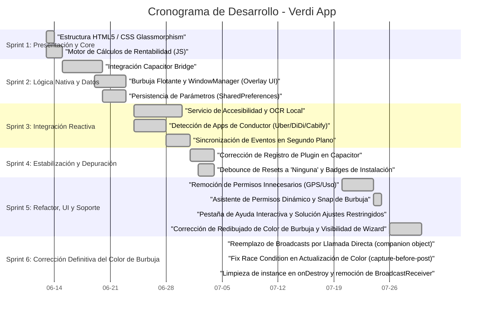

# 📅 Cronograma de Desarrollo (Carta Gantt) - Verdi App

Este documento presenta la planificación temporal y el registro de hitos del desarrollo de la aplicación **Verdi**, estructurado en formato de Carta Gantt. Las fechas y actividades están mapeadas directamente a partir del historial real de confirmaciones de Git (desde el primer commit el 13 de junio de 2026).

---

## 📊 Vista General del Cronograma

A continuación se muestra la Carta Gantt en formato visual, representando las fases de desarrollo (Sprints):

---

## 📝 Desglose de Fases (Sprints)

### Sprint 1: Presentación & Motor de Cálculos (13 Jun - 15 Jun)
* **Objetivo:** Diseñar la interfaz del conductor y validar los cálculos de rentabilidad matemática.
* **Hitos alcanzados:**
  * Maquetación HTML5 y estilo CSS oscuro premium con efectos de desenfoque (`glassmorphism`).
  * Implementación del algoritmo de rentabilidad operacional restando costos estimados de combustible.

### Sprint 2: Lógica Nátiva y Persistencia (15 Jun - 23 Jun)
* **Objetivo:** Establecer la persistencia de datos y el comportamiento de la burbuja sobre otras apps.
* **Hitos alcanzados:**
  * Integración del puente Capacitor para coordinar peticiones nativas en Android.
  * Renderizado del componente visual flotante sobre el WindowManager nativo.
  * Configuración de la persistencia de datos de costos mediante `SharedPreferences` y `LocalStorage`.

### Sprint 3: Integración Reactiva (24 Jun - 01 Jul)
* **Objetivo:** Vincular la lectura automática de pantalla con los cálculos del semáforo.
* **Hitos alcanzados:**
  * Desarrollo del Accessibility Service seguro para extraer tarifas y distancias del árbol visual de Uber, DiDi y Cabify.
  * Detección activa en segundo plano de la aplicación del conductor actualmente en uso.

### Sprint 4: Estabilización y Depuración (01 Jul - 04 Jul)
* **Objetivo:** Resolver problemas de detección y mejorar la consistencia entre transiciones de apps.
* **Hitos alcanzados:**
  * Corrección en el registro de `VerdiPlugin` en `MainActivity`.
  * Habilitación de la cola de eventos en background con `retainUntilConsumed = true`.
  * Implementación de un debounce de 4 segundos para evitar falsos resets en transiciones rápidas de apps.

### Sprint 6: Corrección Definitiva del Color de Burbuja (01 Ago)
* **Objetivo:** Resolver de forma definitiva y robusta la falta de cambio de color en la burbuja flotante nativa, identificando la causa raíz en el sistema de comunicación entre servicios.
* **Hitos alcanzados:**
  * Identificación de la causa raíz: los broadcasts `UPDATE_BUBBLE` no se entregaban de forma confiable en Android 13+ con `RECEIVER_NOT_EXPORTED`, especialmente cuando la app estaba en background.
  * **Reemplazo total del mecanismo de broadcast** por llamada directa mediante patrón `companion object` con referencia `@Volatile instance` — el mismo enfoque ya probado en `VerdiPlugin.onTripCaptured`.
  * Corrección de una **race condition** en la captura del color: `stateColor` se captura antes del `Handler.post` para garantizar consistencia entre emoji y color de fondo.
  * `instance` ahora se asigna al final de `onCreate()` (post-inicialización de vistas) y se limpia a `null` en `onDestroy()`.
  * Eliminación completa del `BroadcastReceiver`, las `IntentFilter` y las importaciones `@SuppressLint` relacionadas de `FloatingBubbleService`.

### Sprint 5: Refactor, UI y Soporte (20 Jul - 30 Jul)
* **Objetivo:** Optimizar la experiencia de usuario (UX), simplificar permisos y proveer soporte integrado.
* **Hitos alcanzados:**
  * Eliminación de permisos intrusivos de Ubicación (GPS) y Estadísticas de Uso.
  * Snap magnético horizontal de la burbuja al borde de la pantalla (`x=0`).
  * Lanzador nativo `appDetails` para permitir que el conductor desbloquee **Ajustes Restringidos (Botón Gris)**.
  * Incorporación de la pestaña interactiva **Ayuda** con FAQs y rutas paso a paso por marca de teléfono (Xiaomi, Samsung, Realme, Motorola).
  * Solución definitiva de redibujado de color de la burbuja (mediante WindowManager layout update y mutación del drawable) y visualización del Wizard.
