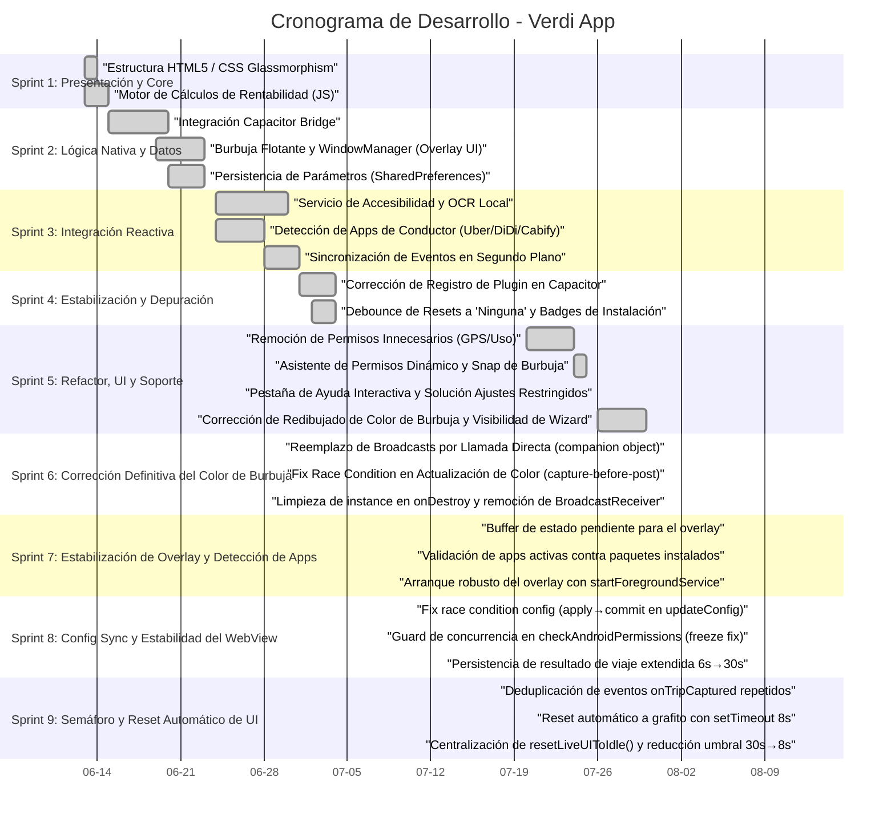

# 📅 Cronograma de Desarrollo (Carta Gantt) - Verdi App

Este documento presenta la planificación temporal y el registro de hitos del desarrollo de la aplicación **Verdi**, estructurado en formato de Carta Gantt. Las fechas y actividades están mapeadas directamente a partir del historial real de confirmaciones de Git (desde el primer commit el 13 de junio de 2026).

---

## 📊 Vista General del Cronograma

A continuación se muestra la Carta Gantt en formato visual, representando las fases de desarrollo (Sprints):

---

## 📝 Desglose de Fases (Sprints)

### Sprint 1: Presentación & Motor de Cálculos (13 Jun - 15 Jun)
* **Objetivo:** Diseñar la interfaz del conductor y validar los cálculos de rentabilidad matemática.
* **Hitos alcanzados:**
  * Maquetación HTML5 y estilo CSS oscuro premium con efectos de desenfoque (`glassmorphism`).
  * Implementación del algoritmo de rentabilidad operacional restando costos estimados de combustible.

### Sprint 2: Lógica Nátiva y Persistencia (15 Jun - 23 Jun)
* **Objetivo:** Establecer la persistencia de datos y el comportamiento de la burbuja sobre otras apps.
* **Hitos alcanzados:**
  * Integración del puente Capacitor para coordinar peticiones nativas en Android.
  * Renderizado del componente visual flotante sobre el WindowManager nativo.
  * Configuración de la persistencia de datos de costos mediante `SharedPreferences` y `LocalStorage`.

### Sprint 3: Integración Reactiva (24 Jun - 01 Jul)
* **Objetivo:** Vincular la lectura automática de pantalla con los cálculos del semáforo.
* **Hitos alcanzados:**
  * Desarrollo del Accessibility Service seguro para extraer tarifas y distancias del árbol visual de Uber, DiDi y Cabify.
  * Detección activa en segundo plano de la aplicación del conductor actualmente en uso.

### Sprint 4: Estabilización y Depuración (01 Jul - 04 Jul)
* **Objetivo:** Resolver problemas de detección y mejorar la consistencia entre transiciones de apps.
* **Hitos alcanzados:**
  * Corrección en el registro de `VerdiPlugin` en `MainActivity`.
  * Habilitación de la cola de eventos en background con `retainUntilConsumed = true`.
  * Implementación de un debounce de 4 segundos para evitar falsos resets en transiciones rápidas de apps.

### Sprint 5: Refactor, UI y Soporte (20 Jul - 30 Jul)
* **Objetivo:** Optimizar la experiencia de usuario (UX), simplificar permisos y proveer soporte integrado.
* **Hitos alcanzados:**
  * Eliminación de permisos intrusivos de Ubicación (GPS) y Estadísticas de Uso.
  * Snap magnético horizontal de la burbuja al borde de la pantalla (`x=0`).
  * Lanzador nativo `appDetails` para permitir que el conductor desbloquee **Ajustes Restringidos (Botón Gris)**.
  * Incorporación de la pestaña interactiva **Ayuda** con FAQs y rutas paso a paso por marca de teléfono (Xiaomi, Samsung, Realme, Motorola).
  * Solución definitiva de redibujado de color de la burbuja (mediante WindowManager layout update y mutación del drawable) y visualización del Wizard.

### Sprint 6: Corrección Definitiva del Color de Burbuja (01 Ago)
* **Objetivo:** Resolver de forma definitiva y robusta la falta de cambio de color en la burbuja flotante nativa, identificando la causa raíz en el sistema de comunicación entre servicios.
* **Hitos alcanzados:**
  * Identificación de la causa raíz: los broadcasts `UPDATE_BUBBLE` no se entregaban de forma confiable en Android 13+ con `RECEIVER_NOT_EXPORTED`, especialmente cuando la app estaba en background.
  * **Reemplazo total del mecanismo de broadcast** por llamada directa mediante patrón `companion object` con referencia `@Volatile instance` — el mismo enfoque ya probado en `VerdiPlugin.onTripCaptured`.
  * Corrección de una **race condition** en la captura del color: `stateColor` se captura antes del `Handler.post` para garantizar consistencia entre emoji y color de fondo.
  * `instance` ahora se asigna al final de `onCreate()` (post-inicialización de vistas) y se limpia a `null` en `onDestroy()`.
  * Eliminación completa del `BroadcastReceiver`, las `IntentFilter` y las importaciones `@SuppressLint` relacionadas de `FloatingBubbleService`.

### Sprint 7: Estabilización de Overlay y Detección de Apps (06 Ago)
* **Objetivo:** Asegurar que el overlay conserve el último estado del viaje y que la UI no muestre como activa una app de conductor que no está instalada.
* **Hitos alcanzados:**
  * Implementación de un **buffer de estado pendiente** en `FloatingBubbleService` para conservar el primer viaje aunque el overlay se inicie más tarde.
  * Validación de la app activa contra los paquetes reales instalados de Uber, DiDi y Cabify, evitando falsos estados de conexión.
  * Arranque más robusto del overlay en Android mediante `ContextCompat.startForegroundService(...)`.

### Sprint 8: Config Sync y Estabilidad del WebView (08 Ago)
* **Objetivo:** Corregir que los cambios de configuración (ganancia mínima, precio combustible, etc.) no se aplicaran correctamente al motor de decisión, y resolver el freeze del WebView por llamadas concurrentes al plugin nativo.
* **Hitos alcanzados:**
  * **Fix race condition en `updateConfig`:** `editor.apply()` (asíncrono) reemplazado por `editor.commit()` (síncrono) en `VerdiPlugin.kt` para garantizar que los datos estén escritos en `SharedPreferences` antes de enviar el broadcast `CONFIG_UPDATED` al `VerdiAccessibilityService`. Esto causaba que el motor de decisión siempre leía los valores antiguos de configuración, ignorando la ganancia mínima configurada por el conductor.
  * **Guard de concurrencia en `checkAndroidPermissions`:** Añadido el flag `_checkingPermissions` en `main.js` para que solo corra una instancia simultánea de la función. El `setInterval` de 2 segundos apilaba llamadas concurrentes cuando el plugin nativo tardaba más de 2s, degradando y congelando el WebView.
  * **Persistencia extendida del resultado del viaje:** El semáforo y los datos del viaje ahora permanecen visibles **30 segundos** (antes eran 6), evitando que el dashboard vuelva a grafito antes de que el conductor pueda leer el análisis.

### Sprint 9: Semáforo y Reset Automático de UI (12 Ago)
* **Objetivo:** Resolver el comportamiento del semáforo que quedaba pegado en un color después de recibir un viaje y no retornaba al estado negro/grafito.
* **Hitos alcanzados:**
  * **Deduplicación de `onTripCaptured`:** El servicio nativo puede emitir el mismo viaje múltiples veces en sucesión rápida. Cada disparo renovaba `lastCapturedTime`, haciendo que la condición de reset nunca se cumpliera. Se implementó una clave de deduplicación `price-distance-timeMins` que descarta eventos idénticos dentro de 10 segundos sin alterar el estado visual.
  * **Reset automático con `setTimeout` de 8 segundos:** Se agregó un timer local dentro de `onTripCaptured` que resetea la UI al estado grafito exactamente 8 segundos después de mostrar el análisis, de forma determinista e independiente del ciclo de polling.
  * **Reducción del umbral de polling de 30 s a 8 s:** El umbral `timeSinceCapture` del `checkAndroidPermissions` (3 puntos) se redujo de 30 000 ms a 8 000 ms para alinearlo con el nuevo timer automático y actuar como respaldo.
  * **Función `resetLiveUIToIdle()` centralizada:** Se extrajo y unificó la lógica de reset de UI (semáforo, título, descripción, métricas) que estaba duplicada en 3 lugares, usando `STATE.lastActiveApp` para mostrar el nombre correcto de la app de conductor activa.
