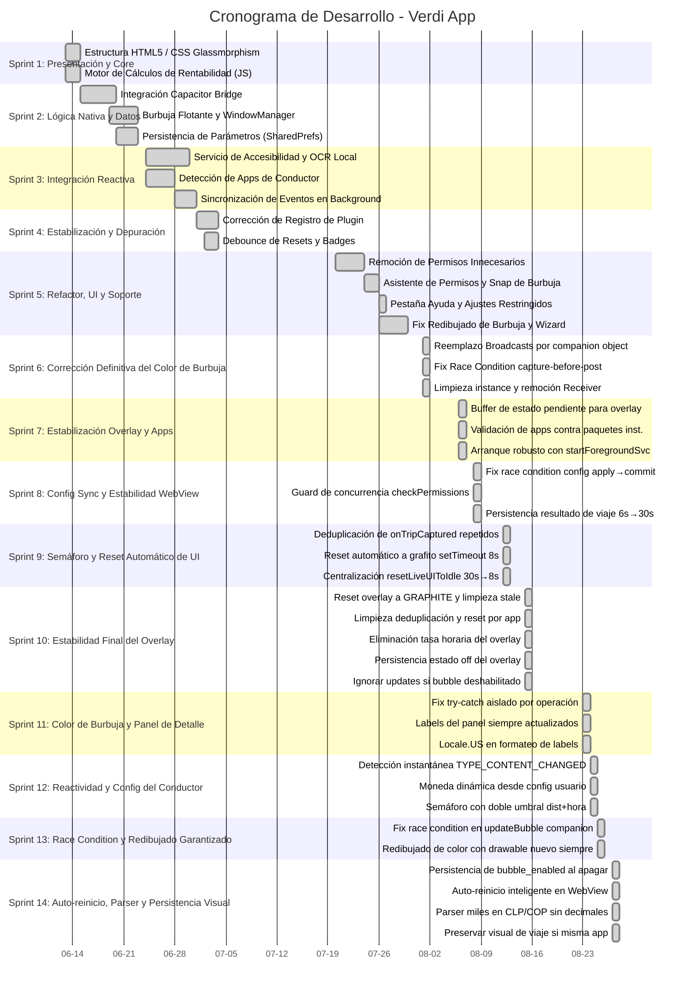

# 📅 Cronograma de Desarrollo (Carta Gantt) - Verdi App

Este documento presenta la planificación temporal y el registro de hitos del desarrollo de la aplicación **Verdi**, estructurado en formato de Carta Gantt. Las fechas y actividades están mapeadas directamente a partir del historial real de confirmaciones de Git (desde el primer commit el 13 de junio de 2026).

---

## 📊 Vista General del Cronograma

A continuación se muestra la Carta Gantt en formato visual, representando las fases de desarrollo (Sprints):

---

## 📝 Desglose de Fases (Sprints)

### Sprint 1: Presentación & Motor de Cálculos (13 Jun - 15 Jun)
* **Objetivo:** Diseñar la interfaz del conductor y validar los cálculos de rentabilidad matemática.
* **Hitos alcanzados:**
  * Maquetación HTML5 y estilo CSS oscuro premium con efectos de desenfoque (`glassmorphism`).
  * Implementación del algoritmo de rentabilidad operacional restando costos estimados de combustible.

### Sprint 2: Lógica Nativa y Persistencia (15 Jun - 23 Jun)
* **Objetivo:** Establecer la persistencia de datos y el comportamiento de la burbuja sobre otras apps.
* **Hitos alcanzados:**
  * Integración del puente Capacitor para coordinar peticiones nativas en Android.
  * Renderizado del componente visual flotante sobre el WindowManager nativo.
  * Configuración de la persistencia de datos de costos mediante `SharedPreferences` y `LocalStorage`.

### Sprint 3: Integración Reactiva (24 Jun - 01 Jul)
* **Objetivo:** Vincular la lectura automática de pantalla con los cálculos del semáforo.
* **Hitos alcanzados:**
  * Desarrollo del Accessibility Service seguro para extraer tarifas y distancias del árbol visual de Uber, DiDi y Cabify.
  * Detección activa en segundo plano de la aplicación del conductor actualmente en uso.

### Sprint 4: Estabilización y Depuración (01 Jul - 04 Jul)
* **Objetivo:** Resolver problemas de detección y mejorar la consistencia entre transiciones de apps.
* **Hitos alcanzados:**
  * Corrección en el registro de `VerdiPlugin` en `MainActivity`.
  * Habilitación de la cola de eventos en background con `retainUntilConsumed = true`.
  * Implementación de un debounce de 4 segundos para evitar falsos resets en transiciones rápidas de apps.

### Sprint 5: Refactor, UI y Soporte (20 Jul - 30 Jul)
* **Objetivo:** Optimizar la experiencia de usuario (UX), simplificar permisos y proveer soporte integrado.
* **Hitos alcanzados:**
  * Eliminación de permisos intrusivos de Ubicación (GPS) y Estadísticas de Uso.
  * Snap magnético horizontal de la burbuja al borde de la pantalla (`x=0`).
  * Lanzador nativo `appDetails` para permitir que el conductor desbloquee **Ajustes Restringidos (Botón Gris)**.
  * Incorporación de la pestaña interactiva **Ayuda** con FAQs y rutas paso a paso por marca de teléfono (Xiaomi, Samsung, Realme, Motorola).
  * Solución definitiva de redibujado de color de la burbuja (mediante WindowManager layout update y mutación del drawable) y visualización del Wizard.

### Sprint 6: Corrección Definitiva del Color de Burbuja (01 Ago)
* **Objetivo:** Resolver de forma definitiva y robusta la falta de cambio de color en la burbuja flotante nativa, identificando la causa raíz en el sistema de comunicación entre servicios.
* **Hitos alcanzados:**
  * Identificación de la causa raíz: los broadcasts `UPDATE_BUBBLE` no se entregaban de forma confiable en Android 13+ con `RECEIVER_NOT_EXPORTED`, especialmente cuando la app estaba en background.
  * **Reemplazo total del mecanismo de broadcast** por llamada directa mediante patrón `companion object` con referencia `@Volatile instance` — el mismo enfoque ya probado en `VerdiPlugin.onTripCaptured`.
  * Corrección de una **race condition** en la captura del color: `stateColor` se captura antes del `Handler.post` para garantizar consistencia entre emoji y color de fondo.
  * `instance` ahora se asigna al final de `onCreate()` (post-inicialización de vistas) y se limpia a `null` en `onDestroy()`.
  * Eliminación completa del `BroadcastReceiver`, las `IntentFilter` y las importaciones `@SuppressLint` relacionadas de `FloatingBubbleService`.

### Sprint 7: Estabilización de Overlay y Detección de Apps (06 Ago)
* **Objetivo:** Asegurar que el overlay conserve el último estado del viaje y que la UI no muestre como activa una app de conductor que no está instalada.
* **Hitos alcanzados:**
  * Implementación de un **buffer de estado pendiente** en `FloatingBubbleService` para conservar el primer viaje aunque el overlay se inicie más tarde.
  * Validación de la app activa contra los paquetes reales instalados de Uber, DiDi y Cabify, evitando falsos estados de conexión.
  * Arranque más robusto del overlay en Android mediante `ContextCompat.startForegroundService(...)`.

### Sprint 8: Config Sync y Estabilidad del WebView (08 Ago)
* **Objetivo:** Corregir que los cambios de configuración (ganancia mínima, precio combustible, etc.) no se aplicaran correctamente al motor de decisión, y resolver el freeze del WebView por llamadas concurrentes al plugin nativo.
* **Hitos alcanzados:**
  * **Fix race condition en `updateConfig`:** `editor.apply()` (asíncrono) reemplazado por `editor.commit()` (síncrono) en `VerdiPlugin.kt` para garantizar que los datos estén escritos en `SharedPreferences` antes de enviar el broadcast `CONFIG_UPDATED` al `VerdiAccessibilityService`. Esto causaba que el motor de decisión siempre leía los valores antiguos de configuración, ignorando la ganancia mínima configurada por el conductor.
  * **Guard de concurrencia en `checkAndroidPermissions`:** Añadido el flag `_checkingPermissions` en `main.js` para que solo corra una instancia simultánea de la función. El `setInterval` de 2 segundos apilaba llamadas concurrentes cuando el plugin nativo tardaba más de 2s, degradando y congelando el WebView.
  * **Persistencia extendida del resultado del viaje:** El semáforo y los datos del viaje ahora permanecen visibles **30 segundos** (antes eran 6), evitando que el dashboard vuelva a grafito antes de que el conductor pueda leer el análisis.

### Sprint 9: Semáforo y Reset Automático de UI (12 Ago)
* **Objetivo:** Resolver el comportamiento del semáforo que quedaba pegado en un color después de recibir un viaje y no retornaba al estado negro/grafito.
* **Hitos alcanzados:**
  * **Deduplicación de `onTripCaptured`:** El servicio nativo puede emitir el mismo viaje múltiples veces en sucesión rápida. Cada disparo renovaba `lastCapturedTime`, haciendo que la condición de reset nunca se cumpliera. Se implementó una clave de deduplicación `price-distance-timeMins` que descarta eventos idénticos dentro de 10 segundos sin alterar el estado visual.
  * **Reset automático con `setTimeout` de 8 segundos:** Se agregó un timer local dentro de `onTripCaptured` que resetea la UI al estado grafito exactamente 8 segundos después de mostrar el análisis, de forma determinista e independiente del ciclo de polling.
  * **Reducción del umbral de polling de 30 s a 8 s:** El umbral `timeSinceCapture` del `checkAndroidPermissions` (3 puntos) se redujo de 30 000 ms a 8 000 ms para alinearlo con el nuevo timer automático y actuar como respaldo.
  * **Función `resetLiveUIToIdle()` centralizada:** Se extrajo y unificó la lógica de reset de UI (semáforo, título, descripción, métricas) que estaba duplicada en 3 lugares, usando `STATE.lastActiveApp` para mostrar el nombre correcto de la app de conductor activa.

### Sprint 10: Estabilidad Final del Overlay (15 Ago)
* **Objetivo:** Eliminar los estados stale del overlay, reforzar el apagado manual del semáforo y dejar el detalle visual más claro para la decisión del conductor.
* **Hitos alcanzados:**
  * **Reset final a `GRAPHITE` y limpieza de estado stale:** Se reforzó el reset del overlay nativo desde `resetLiveUIToIdle()`, y se limpia el estado de viaje cuando cambia de app o cuando la app pasa a `Ninguna` para evitar que el semáforo permanezca en rojo/verde.
  * **Limpieza de deduplicación ante viajes nuevos:** La clave `lastTripKey` se borra al terminar el timer y en cada cambio de app, permitiendo que un viaje nuevo vuelva a evaluarse sin quedar bloqueado.
  * **Detalle del overlay más legible:** Se elimina la línea de `Tasa Horaria` del panel expandido para mantener el foco en gasto y ganancia neta, reduciendo ruido visual y mejorando la lectura rápida.
  * **Estado off persistente del overlay:** Se guarda el estado `bubble_enabled` en `SharedPreferences` y se evita que el servicio vuelva a activarse de forma espontánea tras apretar `Detener` o `Apagar semáforo`.
  * **Ignorar updates mientras está deshabilitado:** El servicio omite `updateBubble()` cuando el bubble está apagado manualmente, evitando la reactivación por eventos nativos o viajes en segundo plano.

### Sprint 11: Color de Burbuja y Panel de Detalle (23 Ago)
* **Objetivo:** Resolver de forma definitiva que la burbuja no cambiaba de color al recibir viajes y que el Verdi Detalle (panel expandido) siempre mostraba guiones en lugar de los datos reales.
* **Hitos alcanzados:**
  * **Fix causa raíz del color:** El único `try-catch` que envolvía toda la función `updateBubbleState()` capturaba silenciosamente la excepción que lanzaba `windowManager.updateViewLayout()` cuando el `bubbleLayout` estaba desconectado del WindowManager (escenario frecuente tras reinicio del servicio), abortando el redibujado antes de que el color se aplicara.
  * **Aislamiento de operaciones en bloques independientes:** Se separó `updateBubbleState()` en tres bloques `try-catch` autónomos: (1) actualización de labels del panel, (2) cambio de color y emoji de la burbuja, (3) `windowManager.updateViewLayout()`. Cada bloque falla de forma controlada sin contaminar los demás.
  * **Labels del panel siempre actualizados:** Al posicionar la actualización de `textPrice`, `textFuel` y `textProfit` como primer paso (antes de cualquier operación con el WindowManager), los datos del viaje se muestran siempre en el Verdi Detalle independientemente de si el `updateViewLayout` falla o no.
  * **Locale explícito en formateo:** Se añadió `Locale.US` al `String.format` de los labels del panel para garantizar el separador de miles correcto sin importar el idioma configurado en el dispositivo.

### Sprint 12: Reactividad Instantánea y Configuración del Conductor (24 Ago)
* **Objetivo:** Eliminar el tiempo de reacción de más de 1 minuto al detectar solicitudes de viaje y corregir el panel de detalle para que use la moneda y los criterios de rentabilidad configurados por el conductor.
* **Hitos alcanzados:**
  * **Detección en milisegundos vía `TYPE_WINDOW_CONTENT_CHANGED`:** El escaneo de textos solo se ejecutaba cuando el `packageName` del evento era explícitamente de una app rideshare. Los eventos `TYPE_WINDOW_CONTENT_CHANGED` —los que se disparan cuando la pantalla cambia y aparece la oferta— llegaban frecuentemente con el `packageName` del shell del sistema, haciendo que el scan no se ejecutara en ese momento. Se corrigió consultando `rootInActiveWindow` como fallback: si el root pertenece a Uber/DiDi/Cabify, el scan se ejecuta en ese mismo evento sin esperar el siguiente ciclo.
  * **Moneda dinámica en el panel de detalle:** El símbolo `"$ "` estaba hardcodeado en `FloatingBubbleService.updateBubbleState()`, ignorando por completo el `currencyCode` enviado desde la configuración del conductor. Se reemplazó por un mapa que convierte `CLP`, `COP`, `ARS`, `MXN`, `PEN`, `BRL`, `UYU`, `USD`, `EUR` a su símbolo o prefijo regional correcto.
  * **Semáforo con doble umbral configurable:** La lógica de decisión solo evaluaba `minPerDistance` e ignoraba `minHourlyEarnings`. Ahora se calcula el porcentaje de cumplimiento de ambos umbrales y se toma el más estricto: Verde requiere cumplir tanto la meta por km como la meta por hora configuradas por el conductor.

### Sprint 13: Race Condition y Redibujado Garantizado (25 Ago)
* **Objetivo:** Eliminar regresiones de redibujado de la burbuja y race conditions en el traspaso de datos del viaje.
* **Hitos alcanzados:**
  * **Redibujado 100% garantizado de la burbuja:** Se reemplazó la mutación del drawable por la creación de un `GradientDrawable` totalmente nuevo en cada actualización, invocando además `invalidate()` y `requestLayout()` sobre el layout de la burbuja.
  * **Eliminación de la race condition en `updateBubble`:** Se captura la referencia `@Volatile instance` en una variable local antes de usarla, previniendo que llamadas concurrentes anulen el puntero y causen que el panel detallado muestre información vieja.

### Sprint 14: Auto-reinicio, Parser y Persistencia Visual (27 Ago)
* **Objetivo:** Prevenir el reinicio no deseado de la burbuja nativa tras el apagado manual del semáforo, robustecer el parseo de precios con separadores de miles de un único punto en monedas sin decimales, y conservar el análisis de viaje frente a reconexiones del mismo app.
* **Hitos alcanzados:**
  * **Persistencia de apagado manual y control de ciclo de vida:** Modificado `FloatingBubbleService.kt` para persistir `bubble_enabled` en `false` al presionar desactivar nativamente. El plugin expone este estado a `main.js` para evitar el auto-reinicio indeseado en el ciclo de polling de permisos.
  * **Parser de miles inteligente en CLP/COP:** Añadida lógica en `VerdiAccessibilityService.kt` que remueve el punto si es un único punto seguido de 3 dígitos (ej. `8.500`) en monedas sin decimales, evitando interpretarlo erróneamente como punto decimal.
  * **Persistencia de estado visual de viaje:** En `main.js`, se restringió el borrado y reset de la UI al dispararse `onAppConnected` para que ocurra únicamente si la app activa ha cambiado. Esto mantiene visible el análisis del semáforo y las métricas de viaje en reconexiones del mismo app.
