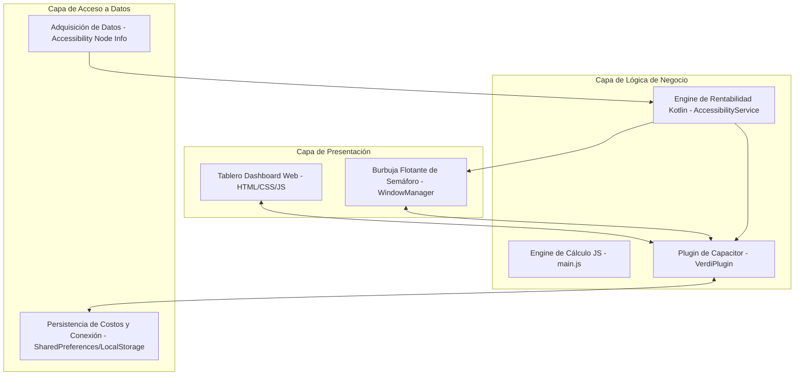
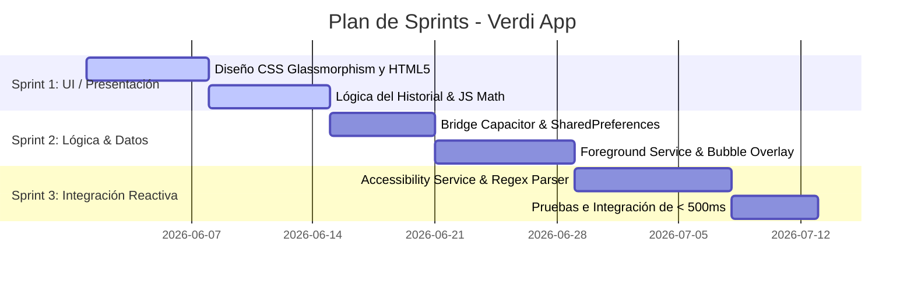

# Verdi - Copiloto Inteligente de Rentabilidad

Verdi es una aplicación móvil híbrida diseñada para conductores de aplicaciones de transporte (Uber, DiDi, Cabify). Su función principal es analizar en tiempo real las ofertas de viajes que aparecen en la pantalla y clasificar su rentabilidad mediante un sistema de semáforo de colores (Grafito, Verde, Amarillo, Rojo).

---

## 🏛️ Arquitectura de 3 Capas (3-Tier Architecture)

El software de Verdi está estructurado siguiendo el patrón de arquitectura de 3 capas para asegurar el desacoplamiento del código, facilitando el desarrollo y la escalabilidad del sistema:



### 1. Capa de Presentación (Presentation Layer)
Gestiona la interfaz de usuario y captura las interacciones directas del conductor:
* **Tablero de Control Web (Vite + CSS + JS):** Una interfaz premium con tema oscuro, efecto glassmorphism y micro-animaciones que permite al conductor modificar sus costos, verificar estadísticas de su turno y revisar el historial del turno.
* **Burbuja Flotante e Interfaz Superpuesta (Kotlin - WindowManager):** Componente visual nativo (Overlay UI) que se dibuja sobre aplicaciones externas, cambia su color en menos de 500 ms y se expande al ser tocado para detallar la rentabilidad estimada.

### 2. Capa de Lógica de Negocio (Business Logic Layer)
Se encarga de procesar la información y aplicar el algoritmo de rentabilidad operacional del viaje:
* **Algoritmo de Rentabilidad:** Calcula la proyección de ingresos netos y la tasa de ganancia por distancia restando el costo proyectado de combustible. La tasa horaria se calcula y muestra a modo puramente informativo, mientras que el semáforo decide el color exclusivamente en función de la ganancia por distancia.
* **Capacitor Bridge (VerdiPlugin):** Actúa como el puente lógico entre el cliente web y el backend en Kotlin, coordinando las solicitudes de permisos nativos, la obtención del estado del último conductor conectado y el arranque del Foreground Service de la burbuja.

### 3. Capa de Datos (Data Layer)
Gestiona la persistencia de los parámetros y la captura de información cruda en pantalla:
* **Persistencia Local (SharedPreferences / LocalStorage):** Lee y escribe los valores de configuración de costos (precio de combustible, rendimiento del vehículo, ganancia por distancia, divisa), el estado de conexión persistente del último app de conductor activo, y almacena las coordenadas de la última posición preferida de la burbuja.
* **Adquisición Reactiva de Datos (Accessibility Node Scanner):** Servicio que interviene de manera segura en el árbol de elementos visuales de Uber/DiDi/Cabify para extraer los textos de tarifas, distancias y tiempos de viaje.

---

## 📋 Requerimientos Funcionales del Sistema

Basados en el documento de especificación funcional original de Verdi, el sistema cumple e implementa las siguientes capacidades y requerimientos funcionales:

1. **Detección y Captura Automática de Ofertas:** Monitoreo activo y seguro en segundo plano de las aplicaciones de transporte compatibles (Uber, DiDi y Cabify) para capturar ofertas de viajes en el momento en que aparecen en pantalla.
2. **Lectura Inteligente de Parámetros (OCR Local):** Extracción local (sin conexión a internet) del precio bruto, distancia total de viaje y tiempo estimado a partir de los elementos visuales de la pantalla.
3. **Configuración Operativa del Conductor:** Interfaz de configuración para ingresar costos reales: precio de combustible local, rendimiento del vehículo y ganancia mínima deseada por distancia.
4. **Cálculo de Rentabilidad y Semáforo:** Deducción automática del gasto proyectado de combustible de la tarifa capturada para calcular la ganancia neta y clasificar visualmente el viaje (Verde: Rentable, Amarillo: Aceptable, Rojo: No Recomendado/Pérdida) basándose en las metas configuradas.
5. **Burbuja Flotante Activa (Overlay UI):** Widget circular flotante que permanece visible sobre las apps de conductor, cambia de color reactivamente en menos de 500 ms, y es arrastrable por la pantalla (guardando su última ubicación).
6. **Detalle de Margen Operativo:** Panel desplegable al presionar la burbuja flotante que detalla el costo estimado de gasolina, ganancia neta proyectada y la tasa horaria estimada del viaje.
7. **Monitoreo de Estado y Conexión de Apps:** Detección en tiempo real de qué aplicación de conductor está activa y en primer plano, actualizando el tablero principal con el estado `"Conectado a [App]"` y el mensaje `"Esperando viaje..."`.
8. **Persistencia Local de Parámetros:** Guardado físico inmediato de todas las configuraciones del usuario (costos, monedas, unidades y posición de la burbuja) utilizando `SharedPreferences` y `LocalStorage` para que funcionen sin conexión.
9. **Soporte Multidivisa y Multiunidad:** Conversión automática de distancias (KM o Millas), unidades de combustible (Litros o Galones), rendimientos (KM/L o MPG) y monedas de la región (CLP, USD, COP, MXN, EUR, etc.).

---

## 👥 Marco de Trabajo Ágil: SCRUM

El ciclo de vida de desarrollo de Verdi se organiza bajo la metodología ágil **SCRUM**, orientando el desarrollo al valor continuo para el conductor (Product Owner).

### 1. Roles de Scrum
* **Product Owner (El Conductor):** Define las prioridades del Product Backlog basándose en las necesidades del día a día en la calle (ej. exactitud de los regex de distancias, rapidez de respuesta del semáforo).
* **Scrum Master:** Facilita la resolución de impedimentos técnicos (ej. control de permisos en Android 14 API 34, flujos de Foreground Services en segundo plano, compatibilidades de JVM).
* **Equipo de Desarrollo (Developers):** Equipo multidisciplinario encargado del desarrollo de la interfaz de usuario en JS/CSS y del backend nativo de Android en Kotlin.

### 2. Artefactos de Scrum
* **Product Backlog:** Listado de historias de usuario derivadas del documento funcional `Verdi.docx` (burbuja flotante, lectura inteligente, guardado local de configuraciones, historial local, monitoreo de conexión).
* **Sprint Backlog:** Tareas seleccionadas del Backlog para ser completadas en el Sprint activo.
* **Incremento de Software:** Entregable ejecutable (archivo APK compilado y depurado) con el semáforo inteligente y la lectura de pantalla operativa.

### 3. Planificación de Sprints



* **Sprint 1: Capa de Presentación & Historial (Duración: 2 Semanas)**
  * **Sprint Goal:** Crear la interfaz del conductor y validar los cálculos de rentabilidad de forma visual.
  * **Entregable:** Dashboard web interactivo con controles deslizantes y pestaña de historial de viajes.
* **Sprint 2: Lógica de Interfaz y Datos Locales (Duración: 2 Semanas)**
  * **Sprint Goal:** Establecer la persistencia de datos nativa y la interfaz flotante sobre otras apps.
  * **Entregable:** Aplicación empaquetada que inicia el Foreground Service y persiste los parámetros en SharedPreferences.
* **Sprint 3: Captura de Datos Reactiva en Tiempo Real (Duración: 2 Semanas)**
  * **Sprint Goal:** Ligar la lectura automática de pantalla con los cálculos nativos en tiempo real y mostrar el estado de conexión a las apps.
  * **Entregable:** APK final de Verdi con el servicio de accesibilidad leyendo ofertas en Uber/DiDi/Cabify, actualizando el semáforo e indicando a qué app se encuentra conectado.

---

## 🚀 Funcionalidades Clave

* **🔍 Captura Automática y Lectura Inteligente:** Monitorea y lee en tiempo real el contenido de la pantalla cuando el conductor está en Uber, DiDi o Cabify, extrayendo la tarifa, distancia y tiempo del viaje.
* **🧮 Algoritmo de Rentabilidad Offline:** Realiza el cálculo matemático de rentabilidad deduciendo el costo estimado de combustible y verificando si cumple con tus objetivos de ingresos por distancia. Funciona de manera 100% local (sin depender de conexión a internet).
* **🟢 Semáforo Inteligente:** Muestra de forma visual e inmediata la calidad del viaje:
  * **Verde (Rentable):** Cumple con la meta de ganancia por distancia.
  * **Amarillo (Marginal):** Viaje aceptable que se encuentra cerca del límite mínimo de distancia.
  * **Rojo (Poco rentable / Pérdida):** No cumple la meta mínima de distancia o genera pérdida.
* **📡 Indicador de Conexión de Aplicaciones (Novedad):** Muestra dinámicamente en el panel principal si el sistema está conectado a la aplicación de conductores (ej: **"Conectado a Cabify"**) y el estado de **"Esperando viaje..."** en color Grafito, de forma que el conductor sabe en tiempo real que el servicio de accesibilidad está listo y operando en la app correcta.
* **💬 Burbuja Flotante Activa (Overlay):** Un widget interactivo que flota sobre las otras aplicaciones y cambia de color en menos de 500 ms al recibir un viaje. Se puede arrastrar y reposicionar libremente, recordando su ubicación preferida.
* **🌎 Soporte Regional Adaptable:** Admite múltiples monedas (CLP, USD, COP, MXN, EUR, etc.) y unidades regionales (KM/Millas, Litros/Galones, KM/L, MPG) sin alterar la lógica interna.

---

## 💻 Tecnologías Utilizadas

* **HTML5 & CSS3 Premium:** Tema oscuro con glassmorphism.
* **JavaScript Moderno (ES6):** Reactividad en la UI del panel de control.
* **Vite:** Motor de desarrollo y empaquetado para una carga ultrarrápida.
* **Capacitor 6:** Framework de empaquetado e integración del plugin de puente nativo.
* **Kotlin (1.9.22):** Lógica nativa de segundo plano y servicios Android.
* **Android Accessibility Services:** Captura en tiempo real de textos en pantalla.
* **Android WindowManager Overlay:** Renderizado de UI flotante en el sistema.

---

## 🚀 Cómo Ejecutar el Proyecto

### Requisitos Previos
* **Node.js** (v18 o superior) instalado.
* **Android Studio** instalado con el SDK de Android (API 34 recomendada) y JDK 17 o 21 configurado.
* Un teléfono físico Android con depuración USB activa (para probar la burbuja y accesibilidad) o un emulador.

### Paso 1: Instalar dependencias e iniciar el servidor de desarrollo
1. Instala los paquetes:
   ```bash
   npm install
   ```
2. Ejecuta el servidor web local:
   ```bash
   npm run dev
   ```

### Paso 2: Compilar y sincronizar con Android
1. Construye el bundle de producción web:
   ```bash
   npm run build
   ```
2. Sincroniza con Android:
   ```bash
   npx cap sync
   ```

### Paso 3: Compilar y Lanzar la App
1. Para compilar desde consola en Windows:
   ```powershell
   .\gradlew.bat assembleDebug
   ```
2. O abre el proyecto en Android Studio:
   ```bash
   npx cap open android
   ```
   Conecta tu dispositivo Android y haz clic en **Run app** (botón verde de reproducción) en Android Studio para instalarla.

### Paso 4: Activación de los permisos en el teléfono
1. Abre la app **Verdi** instalada.
2. En la pestaña **Panel**, otorga el permiso de **Burbuja Flotante** (Permitir mostrar sobre otras aplicaciones).
3. Otorga el permiso de **Lectura de Pantalla** (se abrirán los Ajustes de Accesibilidad de tu teléfono. Busca "Verdi", **desactívalo y vuélvelo a activar** para asegurar que el sistema Android lo inicialice correctamente).
4. Abre Uber, DiDi o Cabify. La burbuja pasará a color Grafito (`🔘`) esperando ofertas. Al recibir un viaje, se iluminará con el color del semáforo correspondiente y te mostrará el análisis completo de rentabilidad.

