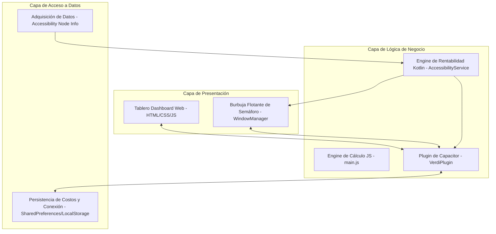
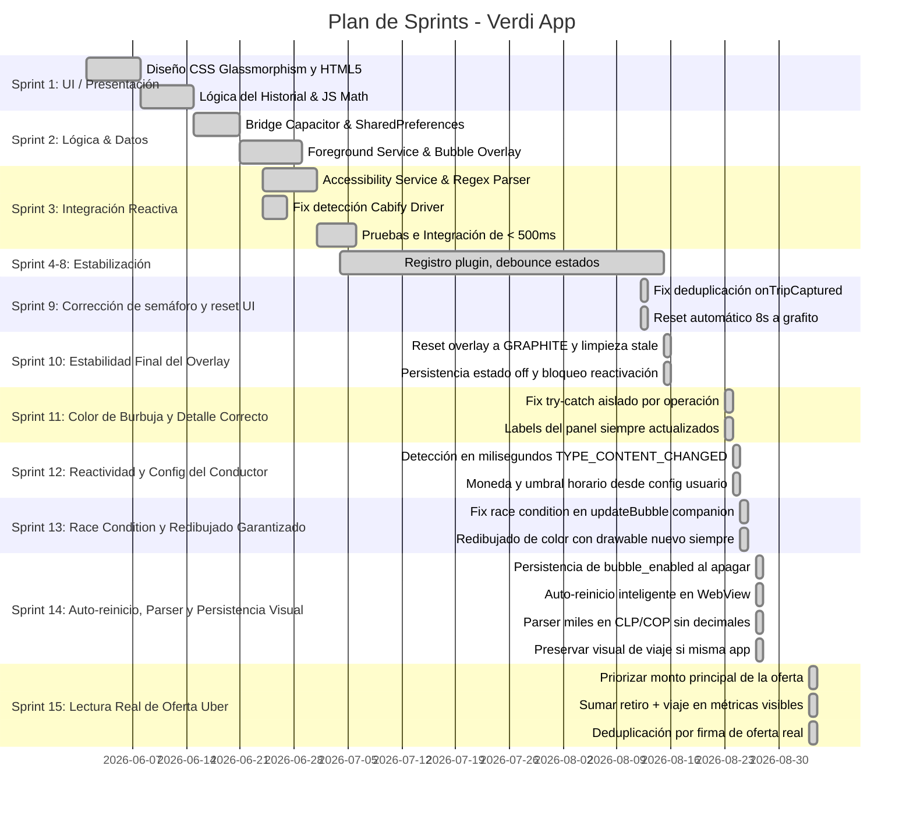

# Verdi - Copiloto Inteligente de Rentabilidad

Verdi es una aplicación móvil híbrida diseñada para conductores de aplicaciones de transporte (Uber, DiDi, Cabify). Su función principal es analizar en tiempo real las ofertas de viajes que aparecen en la pantalla y clasificar su rentabilidad mediante un sistema de semáforo de colores (Grafito, Verde, Amarillo, Rojo).

---

## 🏛️ Arquitectura de 3 Capas (3-Tier Architecture)

El software de Verdi está estructurado siguiendo el patrón de arquitectura de 3 capas para asegurar el desacoplamiento del código, facilitando el desarrollo y la escalabilidad del sistema:


```mermaid
graph TD
    subgraph Capa de Presentación
        UI[Tablero Dashboard Web - HTML/CSS/JS]
        Bubble[Burbuja Flotante de Semáforo - WindowManager]
    end
    
    subgraph Capa de Lógica de Negocio
        MathJS[Engine de Cálculo JS - main.js]
        MathKT[Engine de Rentabilidad Kotlin - AccessibilityService]
        Bridge[Plugin de Capacitor - VerdiPlugin]
    end
    
    subgraph Capa de Acceso a Datos
        Prefs[Persistencia de Costos y Conexión - SharedPreferences/LocalStorage]
        ScreenReader[Adquisición de Datos - Accessibility Node Info]
    end
    
    UI <--> Bridge
    Bubble <--> Bridge
    Bridge <--> Prefs
    ScreenReader --> MathKT
    MathKT --> Bubble
    MathKT --> Bridge
```

### 1. Capa de Presentación (Presentation Layer)
Gestiona la interfaz de usuario y captura las interacciones directas del conductor:
* **Tablero de Control Web (Vite + CSS + JS):** Una interfaz premium con tema oscuro, efecto glassmorphism y micro-animaciones que permite al conductor modificar sus costos, verificar estadísticas de su turno y revisar el historial del turno.
* **Burbuja Flotante e Interfaz Superpuesta (Kotlin - WindowManager):** Componente visual nativo (Overlay UI) que se dibuja sobre aplicaciones externas, cambia su color en menos de 500 ms y se expande al ser tocado para detallar la rentabilidad estimada.

### 2. Capa de Lógica de Negocio (Business Logic Layer)
Se encarga de procesar la información y aplicar el algoritmo de rentabilidad operacional del viaje:
* **Algoritmo de Rentabilidad:** Calcula la proyección de ingresos netos y la tasa de ganancia por distancia restando el costo proyectado de combustible. La tasa horaria se calcula internamente como dato auxiliar para la lógica del viaje, pero en la burbuja/overlay el detalle visual se mantiene enfocado en el gasto y la ganancia neta para evitar ruido visual y mejorar la lectura rápida del conductor.
* **Capacitor Bridge (VerdiPlugin):** Actúa como el puente lógico entre el cliente web y el backend en Kotlin, coordinando las solicitudes de permisos nativos, la obtención del estado del último conductor conectado y el arranque del Foreground Service de la burbuja.

### 3. Capa de Datos (Data Layer)
Gestiona la persistencia de los parámetros y la captura de información cruda en pantalla:
* **Persistencia Local (SharedPreferences / LocalStorage):** Lee y escribe los valores de configuración de costos (precio de combustible, rendimiento del vehículo, ganancia por distancia, divisa), el estado de conexión persistente del último app de conductor activo, y almacena las coordenadas de la última posición preferida de la burbuja.
* **Adquisición Reactiva de Datos (Accessibility Node Scanner):** Servicio que interviene de manera segura en el árbol de elementos visuales de Uber/DiDi/Cabify para extraer los textos de tarifas, distancias y tiempos de viaje.

---

## 📋 Requerimientos Funcionales del Sistema

Basados en el documento de especificación funcional original de Verdi, el sistema cumple e implementa las siguientes capacidades y requerimientos funcionales:

1. **Detección y Captura Automática de Ofertas:** Monitoreo activo y seguro en segundo plano de las aplicaciones de transporte compatibles (Uber, DiDi y Cabify) para capturar ofertas de viajes en el momento en que aparecen en pantalla.
2. **Lectura Inteligente de Parámetros (OCR Local):** Extracción local (sin conexión a internet) del precio bruto, distancia total de viaje y tiempo estimado a partir de los elementos visuales de la pantalla.
3. **Configuración Operativa del Conductor:** Interfaz de configuración para ingresar costos reales: precio de combustible local, rendimiento del vehículo y ganancia mínima deseada por distancia.
4. **Cálculo de Rentabilidad y Semáforo:** Deducción automática del gasto proyectado de combustible de la tarifa capturada para calcular la ganancia neta y clasificar visualmente el viaje (Verde: Rentable, Amarillo: Aceptable, Rojo: No Recomendado/Pérdida) basándose en las metas configuradas.
5. **Burbuja Flotante Activa (Overlay UI):** Widget circular flotante que permanece visible sobre las apps de conductor, cambia de color reactivamente en menos de 500 ms, y es arrastrable por la pantalla (guardando su última ubicación).
6. **Detalle de Margen Operativo:** Panel desplegable al presionar la burbuja flotante que detalla el costo estimado de gasolina y la ganancia neta proyectada del viaje, sin mostrar la tasa horaria para mantener la información más clara y directa en pantalla.
7. **Monitoreo de Estado y Conexión de Apps:** Detección en tiempo real de qué aplicación de conductor está activa y en primer plano, actualizando el tablero principal con el estado `"Conectado a [App]"` y el mensaje `"Esperando viaje..."`.
8. **Persistencia Local de Parámetros:** Guardado físico inmediato de todas las configuraciones del usuario (costos, monedas, unidades y posición de la burbuja) utilizando `SharedPreferences` y `LocalStorage` para que funcionen sin conexión.
9. **Soporte Multidivisa y Multiunidad:** Conversión automática de distancias (KM o Millas), unidades de combustible (Litros o Galones), rendimientos (KM/L o MPG) y monedas de la región (CLP, USD, COP, MXN, EUR, etc.).

---

## 👥 Marco de Trabajo Ágil: SCRUM

El ciclo de vida de desarrollo de Verdi se organiza bajo la metodología ágil **SCRUM**, orientando el desarrollo al valor continuo para el conductor (Product Owner).

### 1. Roles de Scrum
* **Product Owner (El Conductor):** Define las prioridades del Product Backlog basándose en las necesidades del día a día en la calle (ej. exactitud de los regex de distancias, rapidez de respuesta del semáforo).
* **Scrum Master:** Facilita la resolución de impedimentos técnicos (ej. control de permisos en Android 14 API 34, flujos de Foreground Services en segundo plano, compatibilidades de JVM).
* **Equipo de Desarrollo (Developers):** Equipo multidisciplinario encargado del desarrollo de la interfaz de usuario en JS/CSS y del backend nativo de Android en Kotlin.

### 2. Artefactos de Scrum
* **Product Backlog:** Listado de historias de usuario derivadas del documento funcional `Verdi.docx` (burbuja flotante, lectura inteligente, guardado local de configuraciones, historial local, monitoreo de conexión).
* **Sprint Backlog:** Tareas seleccionadas del Backlog para ser completadas en el Sprint activo.
* **Incremento de Software:** Entregable ejecutable (archivo APK compilado y depurado) con el semáforo inteligente y la lectura de pantalla operativa.

### 3. Planificación de Sprints


```mermaid
gantt
    title Plan de Sprints - Verdi App
    dateFormat  YYYY-MM-DD
    section Sprint 1: UI / Presentación
    Diseño CSS Glassmorphism y HTML5    :done, s1, 2026-06-01, 7d
    Lógica del Historial & JS Math      :done, s2, after s1, 7d
    section Sprint 2: Lógica & Datos
    Bridge Capacitor & SharedPreferences :done, s3, 2026-06-15, 6d
    Foreground Service & Bubble Overlay  :done, s4, after s3, 8d
    section Sprint 3: Integración Reactiva
    Accessibility Service & Regex Parser :done, s5, 2026-06-24, 7d
    Fix detección Cabify Driver          :done, s6, 2026-06-24, 3d
    Pruebas e Integración de < 500ms     :done, s7, after s5, 5d
    section Sprint 4-8: Estabilización
    Registro plugin, debounce estados    :done, s8, 2026-07-04, 42d
    section Sprint 9: Corrección de semáforo y reset UI
    Fix deduplicación onTripCaptured     :done, s9, 2026-08-12, 1d
    Reset automático 8s a grafito        :done, s10, 2026-08-12, 1d
    section Sprint 10: Estabilidad Final del Overlay
    Reset overlay a GRAPHITE y limpieza stale :done, s11, 2026-08-15, 1d
    Persistencia estado off y bloqueo reactivación :done, s12, 2026-08-15, 1d
    section Sprint 11: Color de Burbuja y Detalle Correcto
    Fix try-catch aislado por operación     :done, s13, 2026-08-23, 1d
    Labels del panel siempre actualizados   :done, s14, 2026-08-23, 1d
    section Sprint 12: Reactividad y Config del Conductor
    Detección en milisegundos TYPE_CONTENT_CHANGED :done, s15, 2026-08-24, 1d
    Moneda y umbral horario desde config usuario   :done, s16, 2026-08-24, 1d
    section Sprint 13: Race Condition y Redibujado Garantizado
    Fix race condition en updateBubble companion   :done, s17, 2026-08-25, 1d
    Redibujado de color con drawable nuevo siempre :done, s18, 2026-08-25, 1d
    section Sprint 14: Auto-reinicio, Parser y Persistencia Visual
    Persistencia de bubble_enabled al apagar    :done, s19, 2026-08-27, 1d
    Auto-reinicio inteligente en WebView        :done, s20, 2026-08-27, 1d
    Parser miles en CLP/COP sin decimales       :done, s21, 2026-08-27, 1d
    Preservar visual de viaje si misma app      :done, s22, 2026-08-27, 1d
    section Sprint 15: Lectura Real de Oferta Uber
    Priorizar monto principal de la oferta      :done, s23, 2026-09-03, 1d
    Sumar retiro + viaje en métricas visibles   :done, s24, 2026-09-03, 1d
    Deduplicación por firma de oferta real      :done, s25, 2026-09-03, 1d
```

* **Sprint 1: Capa de Presentación & Historial (Duración: 2 Semanas)**
  * **Sprint Goal:** Crear la interfaz del conductor y validar los cálculos de rentabilidad de forma visual.
  * **Entregable:** Dashboard web interactivo con controles deslizantes y pestaña de historial de viajes.
* **Sprint 2: Lógica de Interfaz y Datos Locales (Duración: 2 Semanas)**
  * **Sprint Goal:** Establecer la persistencia de datos nativa y la interfaz flotante sobre otras apps.
  * **Entregable:** Aplicación empaquetada que inicia el Foreground Service y persiste los parámetros en SharedPreferences.
* **Sprint 3: Captura de Datos Reactiva en Tiempo Real (Duración: 2 Semanas) — ✅ Completado**
  * **Sprint Goal:** Ligar la lectura automática de pantalla con los cálculos nativos en tiempo real y mostrar el estado de conexión a las apps.
  * **Entregable:** APK de Verdi con el servicio de accesibilidad leyendo ofertas en Uber/DiDi/Cabify, actualizando el semáforo e indicando a qué app se encuentra conectado.
* **Sprint 4: Estabilización del Sistema de Detección (Duración: 1 Semana) — ✅ Completado**
  * **Sprint Goal:** Resolver los bugs de detección de app activa, registro correcto del plugin Capacitor y estabilidad del estado entre transiciones de apps.
  * **Entregable:** APK estable con detección confiable de Cabify/Uber/DiDi, transición correcta entre primer y segundo plano, y badges de instalación actualizados en tiempo real.
* **Sprint 5: Refactor, UX y Soporte (Duración: 2 Semanas) — ✅ Completado**
  * **Sprint Goal:** Simplificar permisos, mejorar la experiencia de usuario y proveer soporte integrado por marca de teléfono.
  * **Entregable:** APK con asistente de permisos dinámico, snap magnético de burbuja, pestaña de Ayuda interactiva y solución para Ajustes Restringidos.
* **Sprint 6: Corrección Definitiva del Color de Burbuja (1 día) — ✅ Completado**
  * **Sprint Goal:** Resolver de forma definitiva la falta de cambio de color en la burbuja flotante eliminando el mecanismo de broadcasts.
  * **Entregable:** APK con cambio de color instantáneo garantizado mediante llamada directa `companion object`.
* **Sprint 7: Estabilización de Overlay y Detección de Apps (1 día) — ✅ Completado**
  * **Sprint Goal:** Asegurar que el overlay conserve el último estado del viaje y que la UI no muestre apps no instaladas como activas.
  * **Entregable:** APK con buffer de estado pendiente y validación de apps instaladas.
* **Sprint 8: Config Sync y Estabilidad del WebView (1 día) — ✅ Completado**
  * **Sprint Goal:** Corregir la propagación de configuración al motor de cálculo y el freeze del WebView por llamadas concurrentes.
  * **Entregable:** APK con `editor.commit()` síncrono, guard `_checkingPermissions` y resultado de viaje visible 30 s.
* **Sprint 9: Semáforo y Reset Automático de UI (1 día) — ✅ Completado**
  * **Sprint Goal:** Resolver el semáforo que quedaba pegado en un color indefinidamente tras recibir un viaje.
  * **Entregable:** APK con deduplicación de eventos, reset determinista a los 8 s y función `resetLiveUIToIdle()` centralizada.
* **Sprint 10: Estabilidad Final del Overlay (1 día) — ✅ Completado**
  * **Sprint Goal:** Eliminar los estados stale del overlay, reforzar el apagado manual y simplificar el panel de detalle del conductor.
  * **Entregable:** APK con reset a `GRAPHITE` robusto, `bubble_enabled` persistente y panel de detalle sin tasa horaria.

* **Sprint 11: Color de Burbuja y Panel de Detalle (1 día) — ✅ Completado**
  * **Sprint Goal:** Resolver de forma definitiva que la burbuja flotante no cambiaba de color y que el Verdi Detalle siempre mostraba guiones (`--`) en lugar de los datos reales del viaje.
  * **Entregable:** APK con burbuja que cambia de color correctamente en cada viaje y panel expandido que muestra precio, gasto de gasolina y ganancia neta reales.
* **Sprint 12: Reactividad Instantánea y Configuración del Conductor (1 día) — ✅ Completado**
  * **Sprint Goal:** Eliminar el tiempo de reacción de >1 minuto al detectar solicitudes de viaje y corregir el panel de detalle para que use la moneda y los criterios configurados por el conductor.
  * **Entregable:** APK con detección de viaje en milisegundos, moneda dinámica en el panel de detalle y lógica de semáforo basada en ambos umbrales configurados por el usuario (ganancia por km y ganancia horaria mínima).
* **Sprint 13: Race Condition y Redibujado Garantizado (1 día) — ✅ Completado**
  * **Sprint Goal:** Eliminar dos regresiones persistentes: la burbuja que seguía sin cambiar de color en ciertos arranques del servicio, y el panel de detalle que aún mostraba datos de un viaje anterior en lugar del viaje recién capturado.
  * **Entregable:** APK con redibujado de color garantizado mediante `GradientDrawable` nuevo en cada actualización y sin race condition en la asignación de `instance` del companion object.
* **Sprint 14: Auto-reinicio, Parser y Persistencia Visual (1 día) — ✅ Completado**
  * **Sprint Goal:** Resolver el auto-reinicio indeseado de la burbuja flotante tras apagado manual, optimizar la lectura de precios en monedas sin decimales (CLP/COP) cuando traen separadores de miles de un punto (ej: `8.500`), y evitar que el estado visual del viaje se limpie en reconexiones del mismo app.
  * **Entregable:** APK con persistencia de apagado manual (`bubble_enabled`), auto-reinicio inteligente condicionado a la preferencia nativa, parser adaptado a monedas sin decimales y lógica de retención de visuales en el WebView.
* **Sprint 15: Lectura Real de Oferta Uber y Deduplicación Fina (1 día) — ✅ Completado**
  * **Sprint Goal:** Corregir la lectura errónea del monto principal de Uber, evitar que el detalle de la burbuja use cifras ajenas al viaje y permitir que nuevas solicitudes similares vuelvan a analizarse sin quedar bloqueadas.
  * **Entregable:** APK con parser que prioriza el precio principal de la oferta, suma retiro + viaje cuando ambos datos están presentes y usa deduplicación por firma real de oferta para no dejar viajes nuevos sin lectura.

---

* **🔍 Captura Automática y Lectura Inteligente:** Monitorea y lee en tiempo real el contenido de la pantalla cuando el conductor está en Uber, DiDi o Cabify, priorizando el monto principal ofertado y extrayendo tarifa, distancia y tiempo reales del viaje.
* **🧮 Algoritmo de Rentabilidad Offline:** Realiza el cálculo matemático de rentabilidad deduciendo el costo estimado de combustible y verificando si cumple con los objetivos de ingresos por distancia. Funciona de manera 100% local (sin depender de conexión a internet).
* **🟢 Semáforo Inteligente:** Muestra de forma visual e inmediata la calidad del viaje:
  * **Verde (Rentable):** Cumple con la meta de ganancia por distancia.
  * **Amarillo (Marginal):** Viaje aceptable que se encuentra cerca del límite mínimo.
  * **Rojo (Poco rentable / Pérdida):** No cumple la meta mínima o genera pérdida.
* **📡 Monitoreo de Apps de Conductor:** Verifica si Uber Driver, DiDi Conductor y Cabify Driver están instaladas e informa su estado en tiempo real (Activa / En segundo plano / No detectada).
* **💬 Burbuja Flotante de Servicio:** Widget interactivo que flota sobre otras apps, cambia de color en menos de 500 ms, hace snap magnético al borde de pantalla y persiste su estado de activación (no se reactiva sola tras apagarla manualmente).
* **🌎 Soporte Regional Adaptable:** Admite múltiples monedas (CLP, USD, COP, MXN, EUR, etc.) y unidades regionales (KM/Millas, Litros/Galones, KM/L, MPG) sin alterar la lógica interna.

---

## 🛠️ Registro de Cambios (Changelog)

### v1.15.0 — Sprint 15 (2026-09-03)

#### 🐛 Bugs Corregidos

| # | Componente | Descripción del bug | Solución aplicada |
|---|---|---|---|
| 1 | `VerdiAccessibilityService.kt` | Uber podía leer mal el monto principal de la oferta y tomar cifras ajenas del card, como la tarifa por km, el rating o números secundarios, provocando que `Precio Oferta` y el color del semáforo quedaran mal calculados. | Se incorporó una selección de candidatos de precio con heurísticas contextuales que prioriza el importe principal visible de la oferta y penaliza montos asociados a `/km`, rating, medios de pago y otros textos no tarifarios. |
| 2 | `VerdiAccessibilityService.kt` | Cuando Uber mostraba por separado el tramo de recogida y el tramo del viaje, Verdi no siempre componía correctamente la métrica total, generando cálculos incompletos en distancia y tiempo. | Se añadió extracción específica de segmentos `pickup` + `viaje`; si ambos están presentes, ahora se suman para evaluar el costo de combustible y la rentabilidad total de la solicitud. |
| 3 | `VerdiAccessibilityService.kt`, `main.js` | Algunas solicitudes nuevas quedaban sin leerse y la burbuja permanecía en negro/grafito porque la deduplicación/cooldown trataba como repetida una oferta distinta o demasiado cercana a la anterior. | Se reemplazó el cooldown global por deduplicación por firma de oferta real en Android y se alineó la clave de deduplicación del WebView a `precio + distancia`, reduciendo falsos bloqueos y permitiendo capturar nuevas ofertas con más consistencia. |

#### ✨ Mejoras
- **Precio Oferta fiel a Uber:** el panel expandido de la burbuja muestra el monto principal realmente ofertado al conductor, evitando cifras colaterales del card.
- **Cálculo más realista de combustible:** cuando la pantalla expone retiro y viaje por separado, ambos tramos se consideran en el análisis.
- **Lectura continua de solicitudes:** el sistema tolera mejor ofertas consecutivas similares sin dejar viajes nuevos sin analizar.

---

### v1.14.0 — Sprint 14 (2026-08-27)

#### 🐛 Bugs Corregidos

| # | Componente | Descripción del bug | Solución aplicada |
|---|---|---|---|
| 1 | `FloatingBubbleService.kt` | La burbuja se auto-reiniciaba sola tras haberla apagado desde el panel de detalle nativo, ya que la preferencia `bubble_enabled` en SharedPreferences no se actualizaba a `false` al presionar el botón de desactivar en la UI flotante. | Se actualiza `bubble_enabled` a `false` en `SharedPreferences` mediante `commit()` inmediatamente en el evento de click del botón de desactivación. |
| 2 | `main.js`, `VerdiPlugin.kt` | El WebView decidía el auto-reinicio del servicio basándose únicamente en `STATE.bubbleActive`. Si el servicio era detenido legítimamente, el WebView lo re-arrancaba de forma errónea en el siguiente ciclo de polling de permisos. | Se expone la preferencia nativa `bubbleEnabled` en el retorno de `checkPermissions` de `VerdiPlugin.kt` y se usa en `main.js` para condicionar el auto-reinicio solo si la burbuja estaba habilitada activamente. |
| 3 | `VerdiAccessibilityService.kt` | Fallos de parseo en tarifas de Uber en CLP/COP (ej: `8.500`). El parser interpretaba el único punto como punto decimal (`8.5`), mientras que en estas monedas representa un separador de miles (`8500`). | Se implementó validación de monedas sin decimales (`CLP`/`COP`). Si la moneda es una de estas y tiene un único punto seguido de 3 dígitos (ej. `.500`), se remueve el punto para parsearlo correctamente como miles. |
| 4 | `main.js` | El semáforo y los datos visuales del viaje se borraban de inmediato si la misma aplicación volvía a disparar un evento de conexión (como enfocar la app o eventos recurrentes sin cambiar de app). | Se restringe el reseteo y borrado de la UI en `onAppConnected` para que ocurra únicamente si el nombre de la app activa realmente cambió (`appChanged`). |

#### ✨ Mejoras
- **Control de ciclo de vida robusto:** Cierre definitivo de la burbuja respetado ante recargas del WebView o loops de comprobación de permisos.
- **Parser numérico ultra-preciso en LATAM:** Detección y conversión perfecta de tarifas regionales sin deformar los montos.
- **Visualización estable del análisis:** El semáforo y datos del viaje se mantienen firmes y legibles en pantalla mientras el conductor esté usando la misma aplicación de transporte.

---

### v1.13.0 — Sprint 13 (2026-08-25)

#### 🐛 Bugs Corregidos

| # | Componente | Descripción del bug | Solución aplicada |
|---|---|---|---|
| 1 | `FloatingBubbleService.kt` | La burbuja seguía sin cambiar de color en ciertos reinicios del servicio. `mutate()` sobre el `GradientDrawable` existente no garantizaba el redibujado en todas las versiones de Android, y el `windowManager.updateViewLayout` que lo forzaba podía fallar y cortar el flujo antes de que el nuevo color se aplicara. | Se reemplaza `mutate()` por la creación de un `GradientDrawable` completamente nuevo en cada llamada. Adicionalmente se invoca `bubbleLayout.invalidate()` + `bubbleLayout.requestLayout()` para garantizar que el `WindowManager` recomponga el overlay incluso si `updateViewLayout` falla. |
| 2 | `FloatingBubbleService.kt` | **Race condition** en `updateBubble` del companion object: si `instance` pasaba de no-null a null justo entre el `if (instance != null)` y el `instance?.updateBubbleState(...)`, la llamada era un no-op silencioso pero `pendingState` se limpiaba de todas formas, perdiendo el estado del viaje. El panel mostraba los datos del viaje anterior en la siguiente apertura. | Se captura `instance` en una variable local `inst` (Kotlin smart-cast) antes de usarla. Si `inst` es no-null se llama directamente sin posibilidad de que otro hilo anule la referencia entre la comprobación y el uso. |

#### ✨ Mejoras
- **Redibujado 100% garantizado:** ya no depende del estado interno del drawable anterior ni del éxito de `updateViewLayout`.
- **Datos del panel siempre frescos:** el panel expandido muestra precio, gasto y ganancia neta del viaje más reciente sin posibilidad de mostrar datos del viaje previo.

---

### v1.12.0 — Sprint 12 (2026-08-24)

#### 🐛 Bugs Corregidos

| # | Componente | Descripción del bug | Solución aplicada |
|---|---|---|---|
| 1 | `VerdiAccessibilityService.kt` | El tiempo de reacción al detectar una solicitud de viaje superaba 1 minuto, haciendo que la oferta ya hubiera desaparecido cuando el semáforo respondía. El escaneo de textos solo se disparaba si el `packageName` del evento de accesibilidad pertenecía explícitamente a uber/didi/cabify. Los eventos `TYPE_WINDOW_CONTENT_CHANGED` — que son los que se disparan cuando el contenido de la pantalla cambia y la oferta aparece — frecuentemente llegan con el `packageName` del shell del sistema, no de la app, por lo que el scan nunca se ejecutaba en ese momento. | El método ahora también consulta `rootInActiveWindow` para identificar qué app está realmente en primer plano cuando el `pkg` del evento no es rideshare. Si el root pertenece a Uber/DiDi/Cabify, el escaneo se ejecuta de inmediato en ese mismo evento, reaccionando en milisegundos. |
| 2 | `FloatingBubbleService.kt` | El símbolo de moneda en el panel de detalle de la burbuja siempre mostraba `"$ "` (dólar americano), ignorando por completo la moneda configurada por el conductor (`CLP`, `COP`, `ARS`, `MXN`, `PEN`, `BRL`, `EUR`, etc.). | Se reemplazó el símbolo hardcodeado por una función que mapea el `currencyCode` recibido desde la configuración del usuario al símbolo o prefijo correcto para cada moneda soportada. |
| 3 | `VerdiAccessibilityService.kt` | La lógica de decisión del semáforo (Verde / Amarillo / Rojo) solo evaluaba el criterio de ganancia mínima por distancia (`minPerDistance`), ignorando completamente el criterio de ganancia horaria mínima (`minHourlyEarnings`) que el conductor configura en Ajustes. | La decisión ahora calcula el porcentaje de cumplimiento de **ambos** umbrales y usa el más estricto: un viaje solo es Verde si la ganancia por km **y** la ganancia horaria superan la meta configurada. |

#### ✨ Mejoras
- **Reactividad de milisegundos:** El semáforo responde a la oferta de viaje en el mismo evento de sistema en que la pantalla cambia, sin esperar a que llegue un segundo evento favorable con el paquete correcto de la app.
- **Moneda fiel a la región:** CLP, COP, ARS, MXN, PEN (S/), BRL (R$), UYU, USD y EUR se muestran con su símbolo correcto en el detalle de la burbuja.
- **Semáforo más preciso:** El conductor que configure una meta horaria alta y una meta por km baja ya no obtendrá falsos verdes — ambos umbrales deben cumplirse simultáneamente.

---

### v1.11.0 — Sprint 11 (2026-08-23)

#### 🐛 Bugs Corregidos

| # | Componente | Descripción del bug | Solución aplicada |
|---|---|---|---|
| 1 | `FloatingBubbleService.kt` | La burbuja flotante no cambiaba de color al recibir un viaje. El único `try-catch` que envolvía toda la función `updateBubbleState()` capturaba silenciosamente la excepción que lanzaba `windowManager.updateViewLayout()` (cuando el `bubbleLayout` estaba desconectado del WindowManager tras un reinicio del servicio), abortando el redibujado y dejando la burbuja en el último color o en grafito. | Se aisló cada operación en su propio `try-catch`. Ahora `windowManager.updateViewLayout()` falla de forma controlada sin afectar el cambio de color del fondo de la burbuja. |
| 2 | `FloatingBubbleService.kt` | El Verdi Detalle (panel expandido) siempre mostraba guiones `--` en lugar del precio, gasto de gasolina y ganancia neta reales. Las actualizaciones de `textPrice`, `textFuel` y `textProfit` estaban ubicadas **después** del `windowManager.updateViewLayout()` en el mismo `try-catch`: cuando ese call lanzaba excepción (Bug 1), los labels nunca llegaban a actualizarse. | Los labels del panel ahora se actualizan en el **primer bloque** (paso 1), antes de cualquier operación con el WindowManager, garantizando que siempre reflejen los datos del viaje capturado. |

#### ✨ Mejoras
- **Robustez del overlay por operación:** cada parte de `updateBubbleState()` (panel, color, WindowManager) está ahora blindada de forma independiente, de modo que un fallo aislado no contamina el resto de la actualización visual.
- **Locale explícito en el formateo:** se añadió `Locale.US` al `String.format` de los labels del panel para garantizar el separador de miles correcto independientemente del idioma configurado en el dispositivo.

---

### v1.10.0 — Sprint 10 (2026-08-15)

#### 🐛 Bugs Corregidos

| # | Componente | Descripción del bug | Solución aplicada |
|---|---|---|---|
| 1 | `main.js` | La burbuja flotante y el panel de detalle quedaban "pegados" en el último color del viaje aunque ya se había vuelto al idle, por lo que los siguientes análisis continuaban apareciendo en rojo o verde incorrectamente. | Se reforzó el reseteo del overlay nativo a `GRAPHITE` desde `resetLiveUIToIdle()`, y además se limpia el estado de viaje cuando cambia de app o cuando la app pasa a `Ninguna`. |
| 2 | `main.js` | La deduplicación de viajes se mantenía activa demasiado tiempo y podía bloquear un viaje nuevo que tenía la misma firma de datos que el anterior. | Se limpia la clave `lastTripKey` al terminar el timer de visualización y en cada cambio de app, permitiendo que viajes nuevos vuelvan a evaluarse sin quedar bloqueados. |
| 3 | `FloatingBubbleService.kt` | El detalle del overlay mostraba la tasa horaria, saturando el panel y desviando la atención de la decisión principal (gasto y ganancia neta). | Se eliminó la línea de `Tasa Horaria` del detalle expandido para mantener la información clara y orientada a la decisión rápida del conductor. |
| 4 | `FloatingBubbleService.kt`, `VerdiPlugin.kt` | El overlay se apagaba unos segundos y luego volvía a activarse solo, incluso tras pulsar "Detener" o "APAGAR SEMÁFORO". La causa era que el servicio se re-arrancaba desde eventos nativos y `START_STICKY` lo volvía a iniciar. | Se usa `START_NOT_STICKY`, se persiste `bubble_enabled` en `SharedPreferences` y se ignora cualquier actualización de estado si la burbuja está desactivada manualmente. |

#### ✨ Mejoras
- **Overlay controlado por el usuario:** una vez apaga la burbuja, esta se mantiene apagada hasta que el conductor la vuelve a iniciar manualmente.
- **Overlay más estable:** la burbuja vuelve a estado seguro al idle y al cambiar de app, evitando estados persistentes incorrectos.
- **Lectura más clara del detalle:** el panel del overlay prioriza precio, gasto y ganancia neta; la tasa horaria queda como dato interno y no se renderiza en la vista flotante.
- **Flujo visual más limpio:** cada nuevo análisis puede reflejar su color real sin quedar bloqueado por un viaje anterior.

---

### v1.8.0 — Sprint 9 (2026-08-12)

#### 🐛 Bugs Corregidos

| # | Componente | Descripción del bug | Solución aplicada |
|---|---|---|---|
| 1 | `main.js` | El semáforo quedaba pegado en un estado de color (rojo, verde o amarillo) indefinidamente después de recibir un viaje. El servicio nativo puede emitir el evento `onTripCaptured` múltiples veces con los mismos datos, lo que reiniciaba `lastCapturedTime` en cada disparo y hacía que la condición de reset jamás se cumpliera. | Se añadió un mecanismo de **deduplicación por clave de viaje** (`price-distance-timeMins`). Si el mismo viaje se emite nuevamente dentro de 10 segundos, el evento se ignora sin reiniciar el timer. |
| 2 | `main.js` | El semáforo nunca volvía a negro (grafito) tras mostrar el análisis de un viaje: el umbral de reset era `30 000 ms` (30 segundos) en el polling, pero dado que el servicio nativo re-disparaba el mismo viaje constantemente, ese umbral nunca se alcanzaba. | Se agregó un `setTimeout` de **8 segundos** directamente dentro de `onTripCaptured` que resetea la UI al estado grafito de forma determinista, independientemente del polling. El umbral del polling también se redujo de `30 000 ms` a `8 000 ms` en los 3 puntos donde se aplica. |
| 3 | `main.js` | La lógica de reset de UI estaba duplicada en 3 lugares con variaciones sutiles, lo que dificultaba mantener el estado correcto (nombre de la app conectada, métricas visibles, emoji). | Se extrajo una función `resetLiveUIToIdle()` reutilizable que centraliza el reseteo del semáforo, el texto de estado y los indicadores de métricas, usando `STATE.lastActiveApp` para mostrar el nombre correcto de la app conectada. |

#### ✨ Mejoras
- **Reset automático garantizado:** El análisis de cada viaje desaparece exactamente a los 8 segundos mediante un timer propio, sin depender del ciclo de polling de 2 segundos.
- **Deduplicación de eventos nativos:** Viajes idénticos emitidos en rápida sucesión ya no acumulan contadores ni reinician el estado visual de forma indebida.
- **Estado de app conectada preservado en el reset:** Al volver a grafito, el panel muestra correctamente `"Conectado a [App]"` si la app de conductor sigue activa, en lugar de un mensaje genérico.

---

### v1.7.0 — Sprint 8 (2026-08-08)

#### 🐛 Bugs Corregidos

| # | Componente | Descripción del bug | Solución aplicada |
|---|---|---|---|
| 1 | `VerdiPlugin.kt` | La configuración guardada por el conductor (ganancia mínima, precio de combustible, etc.) no se aplicaba al motor de cálculo nativo. `editor.apply()` escribe `SharedPreferences` de forma **asíncrona**, y el broadcast `CONFIG_UPDATED` se enviaba antes de que los datos terminaran de escribirse. Al recibir el broadcast, `VerdiAccessibilityService.loadConfig()` leía los valores **anteriores**, ignorando los cambios del conductor. | Reemplazado `editor.apply()` por `editor.commit()` (síncrono). Garantiza que los datos estén completamente persistidos antes de notificar al servicio. |
| 2 | `main.js` | Tras unos minutos de uso, la app se "pegaba" y dejaba de reaccionar. `checkAndroidPermissions` se llama cada 2 segundos via `setInterval`. Si el plugin nativo tardaba más de 2 segundos en responder, se apilaban múltiples llamadas concurrentes, degradando y congelando el WebView. | Añadido el flag `_checkingPermissions`: si ya hay una llamada en curso, la siguiente se descarta hasta que termine la anterior. |
| 3 | `main.js` | El resultado del viaje (semáforo verde/amarillo/rojo y datos del análisis) desaparecía de pantalla a los **6 segundos**, volviendo al estado grafito antes de que el conductor pudiera leer el análisis. | El umbral `timeSinceCapture` aumentado de `6 000 ms` a `30 000 ms` en los 3 puntos de la UI donde se aplica, manteniendo el resultado visible durante 30 segundos. |

#### ✨ Mejoras
- **Configuración inmediata:** Los cambios de parámetros en la pestaña de Ajustes ahora se propagan al motor de decisión en tiempo real, sin necesidad de reiniciar el servicio.
- **App más estable en sesiones largas:** La eliminación de llamadas concurrentes al plugin nativo mejora la fluidez del dashboard durante turnos prolongados.
- **Más tiempo para analizar:** El conductor tiene 30 segundos para leer el análisis de cada viaje antes de que el panel vuelva al estado de espera.

---

### v1.6.0 — Sprint 7b (2026-08-06)

#### 🐛 Bugs Corregidos

| # | Componente | Descripción del bug | Solución aplicada |
|---|---|---|---|
| 1 | `VerdiAccessibilityService.kt` | El `pricePattern` solo reconocía `$`, `€` y `¥` como prefijos de moneda. Uber Chile envía los precios con el formato `CLP7,604`, por lo que nunca se producía match, `detectedPrice` quedaba `null`, no se disparaba `onTripCaptured` y tanto la burbuja como el semáforo del Dashboard permanecían en blanco/grafito indefinidamente. | Se amplió `pricePattern` para reconocer los códigos ISO de moneda latinoamericanos (`CLP`, `COP`, `ARS`, `MXN`, `PEN`, `BRL`, `UYU`) y globales (`USD`, `EUR`) además de los símbolos originales. El grupo capturador se hizo greedy (`[0-9][0-9.,]*`) para cubrir valores con separadores de miles como `"7,604"` o `"1,234,567"`. |
| 2 | `VerdiAccessibilityService.kt` | Con el regex más greedy, el grupo capturado podía incluir un separador residual al final (ej. `"7,604."`) y fallar silenciosamente en `parseFlexibleNumber` devolviendo `null`. | Se añadió `.trimEnd(',', '.')` al inicio de `parseFlexibleNumber` para recortar separadores sobrantes antes de aplicar cualquier lógica de conversión. |

#### ✨ Mejoras
- **Soporte completo de monedas regionales en la detección:** el parser de pantalla ahora identifica precios expresados con prefijos de texto (`CLP`, `COP`, `ARS`, etc.) o con símbolos (`$`, `€`, `£`), tanto antes como después del valor numérico.
- **Parser de números más robusto:** `parseFlexibleNumber` tolera entradas con separadores residuales al final sin arrojar errores ni devolver `null` inesperadamente, manteniendo la cadena de análisis siempre operativa.

---

### v1.5.0 — Sprint 7 (2026-08-06)

#### 🐛 Bugs Corregidos

| # | Componente | Descripción del bug | Solución aplicada |
|---|---|---|---|
| 1 | `FloatingBubbleService.kt`, `VerdiAccessibilityService.kt`, `VerdiPlugin.kt` | El overlay podía quedarse sin actualizar el estado del viaje si el servicio arrancaba después de la primera captura, dejando la burbuja en grafito y sin reflejar la información del panel. | Se implementó un buffer de estado pendiente en `FloatingBubbleService` y se aplica al crear el overlay, de modo que el primer viaje se conserva aunque el servicio se inicie más tarde. |
| 2 | `VerdiPlugin.kt` | Al reabrir la app tras dejarla cerrada mucho tiempo, podía aparecer `DiDi` como última app activa aunque esa app no estuviera instalada. | Se validó el estado contra la instalación real de Uber/DiDi/Cabify antes de mostrarlo en UI y se limpió el valor persistido en `SharedPreferences` cuando ya no corresponde a una app instalada. |
| 3 | `VerdiPlugin.kt` | El arranque del servicio de burbuja era inestable en algunos dispositivos Android al iniciarlo con `startService`. | Se reemplazó por `ContextCompat.startForegroundService(...)` para garantizar un arranque más robusto del overlay en segundo plano. |

#### ✨ Mejoras
- **Estado de overlay robusto:** el panel y la burbuja conservan el último estado del viaje aunque la app haya sido cerrada y reabierta.
- **Limpieza de estados obsoletos:** la app ya no muestra apps de conductor que no están instaladas, evitando falsos activos en el dashboard.
- **Mayor estabilidad en Android 13+:** el arranque del overlay ahora sigue el flujo recomendado para servicios en primer plano.

---

### v1.4.0 — Sprint 6 (2026-08-01)

#### 🐛 Bugs Corregidos

| # | Componente | Descripción del bug | Solución aplicada |
|---|---|---|---|
| 1 | `FloatingBubbleService.kt`, `VerdiAccessibilityService.kt`, `VerdiPlugin.kt` | La burbuja flotante no cambiaba de color (permanecía grafito 🔘) aunque el análisis de rentabilidad era correcto. En Android 13+, los broadcasts locales `UPDATE_BUBBLE` enviados con `setPackage(...)` no se entregaban al servicio de forma confiable cuando la app estaba en background o el sistema recortaba procesos. | Se eliminó por completo el mecanismo de broadcast. Se adoptó el patrón de **llamada directa** mediante `companion object`: `FloatingBubbleService` expone `updateBubble(...)` a través de una referencia `@Volatile private var instance`. Los llamadores (`VerdiAccessibilityService` y `VerdiPlugin`) invocan `FloatingBubbleService.updateBubble(...)` directamente, garantizando entrega instantánea sin intermediarios de IPC. |
| 2 | `FloatingBubbleService.kt` | Posible **race condition** visual: si dos análisis consecutivos llegaban rápido, el `stateColor` capturado dentro del `Handler.post` podía corresponder al segundo análisis mientras el fondo reflejaba el primero, resultando en emoji y color inconsistentes. | `stateColor` ahora se captura en una variable local **antes** del `Handler.post`, congelando el valor correcto en el closure del hilo principal. |
| 3 | `FloatingBubbleService.kt` | Si el servicio recibía una actualización mientras las vistas aún se estaban inicializando, se producía un `NullPointerException`. | `instance = this` se asigna al final de `onCreate()`, **después** de que `createBubbleView()` y `createPanelView()` completan, eliminando la ventana de inicialización parcial. |

#### ✨ Mejoras Técnicas
- **Eliminación del BroadcastReceiver:** `FloatingBubbleService` ya no registra ni necesita un `BroadcastReceiver` para `UPDATE_BUBBLE`. Esto reduce el overhead de IPC, elimina dependencias de contexto Android y simplifica el ciclo de vida del servicio.
- **Limpieza de `instance` en `onDestroy`:** Al destruirse el servicio, `instance` se pone a `null` antes de cualquier otra operación, evitando llamadas a vistas ya removidas del `WindowManager`.

---

### v1.3.0 — Sprint 5 (2026-07-26)

#### 🐛 Bugs Corregidos

| # | Componente | Descripción del bug | Solución aplicada |
|---|---|---|---|
| 1 | `FloatingBubbleService.kt` | La burbuja de servicio no actualizaba su color en pantalla. La mutación del `GradientDrawable` de fondo no provocaba el redibujado de la vista. | Se implementó la mutación explícita del background drawable (`.mutate()`) y la invocación obligatoria a `windowManager.updateViewLayout(bubbleLayout, params)` en el hilo principal para forzar al `WindowManager` a redibujar el overlay con su nuevo estado. |
| 2 | `main.js` | El asistente de instrucciones de bienvenida e inducción (Wizard) se cerraba de forma inmediata al iniciar si existía la bandera de completado en localStorage, dejando al usuario con permisos desactivados. | Se modificó `shouldShow()` para que siempre mantenga visible el Wizard si falta otorgar accesibilidad o burbuja flotante. |
| 3 | `VerdiPlugin.kt` y `VerdiAccessibilityService.kt` | Los broadcasts `UPDATE_BUBBLE` no se entregaban de forma de confianza en dispositivos con Android 13+ debido a restricciones de seguridad sobre intents implícitos. | Se configuró `intent.setPackage(...)` para que el intent sea explícito y el sistema Android lo enrute correctamente. |

#### ✨ Mejoras y Soporte
- **Pestaña interactiva de Ayuda:** Se incorporó una nueva sección de Ayuda (`tab-help`) con instrucciones gráficas paso a paso y acordiones personalizados por marca de teléfono (Xiaomi, Samsung, Realme, Motorola).
- **Atajo para Ajustes Restringidos:** Añadido un botón de diagnóstico rápido en el asistente de ayuda que abre la Info de la App de Verdi, permitiendo al usuario autorizar "Ajustes Restringidos" con dos toques y desbloquear el interruptor gris de accesibilidad.

### v1.2.0 — Sprint 5 (2026-07-24)

#### ✨ Mejoras y Simplificación de Permisos

- **Simplificación del Sistema de Permisos:** Se eliminaron por completo las solicitudes de permisos de Ubicación (`ACCESS_FINE_LOCATION`, etc.) y Bluetooth en la app, reduciendo el acoso de cuadros de diálogo y aumentando la confianza del usuario.
- **Remoción de UsageStats:** Se eliminó el requisito del permiso oculto de Estadísticas de Uso (`PACKAGE_USAGE_STATS`). La detección nativa de apps activas ahora recae de forma exclusiva y limpia en el `VerdiAccessibilityService`.
- **Asistente (Wizard) de Permisos Dinámico:**
  - Analiza y salta pasos de manera adaptativa si detecta que el permiso de accesibilidad o burbuja ya están habilitados.
  - Reacción instantánea mediante `visibilitychange` al regresar de la configuración del sistema Android.
  - Botones interactivos que cambian a verde con la etiqueta `"✓ ¡Permiso Otorgado!"` antes de avanzar automáticamente tras 1 segundo.
  - Resumen dinámico del paso final personalizado que advierte sobre las consecuencias de omitir pasos específicos.
- **Mejoras en el Comportamiento de la Burbuja (Overlay):**
  - **Efecto de Atracción (Snap):** Al ser arrastrada por la pantalla y liberada, la burbuja siempre hace snap horizontal de forma automática y magnética hacia el costado derecho del dispositivo (`x=0`).
  - **Apagado Sencillo y Directo:** Se integró un botón rojo `"APAGAR SEMÁFORO"` en el panel detallado que apaga el servicio directamente (`stopSelf()`).
  - **Sincronización Web-Nativa:** El Dashboard de control web detecta la terminación del proceso nativo de la burbuja y actualiza instantáneamente el interruptor a "Iniciar".

---

### v1.1.0 — Sprint 4 (2026-07-04)

#### 🐛 Bugs Corregidos

| # | Componente | Descripción del bug | Solución aplicada |
|---|---|---|---|
| 1 | `MainActivity.kt` | `VerdiPlugin` no estaba registrado en Capacitor. El error `"Verdi" plugin is not implemented on android` causaba que `VerdiPlugin.load()` nunca se llamara, `instance` siempre fuera `null` y ningún evento llegara al JS. | Se agregó `registerPlugin(VerdiPlugin::class.java)` en `onCreate()` antes de `super.onCreate()`. |
| 2 | `VerdiAccessibilityService.kt` | `detectForegroundAppFromWindowsList()` usaba `?: continue` para la ventana topmost desconocida (ej. Verdi), continuando el loop y encontrando el launcher en background, disparando falsos resets a "Ninguna". | Cambiado a `?: return` — si la ventana topmost es desconocida, se detiene el procesamiento sin modificar el estado. |
| 3 | `main.js` | Los badges `install-badge-uber/didi/cabify` mostraban "Detectando..." permanentemente porque nunca se actualizaba el DOM desde `checkAndroidPermissions`. | Se añade la actualización del badge ("Instalado" / "No instalado") tras recibir `res.uberInstalled`, `res.didiInstalled`, `res.cabifyInstalled`. |
| 4 | `main.js` | Si el evento `onAppConnected` se perdía (timing: Verdi en background cuando Cabify disparó el evento), la UI quedaba en "Inactivo" indefinidamente. | `checkAndroidPermissions` ahora llama a `updateAppConnectionUI(res.activeApp)` cuando la UI no está bloqueada, actualizando el panel cada 2 segundos desde la fuente nativa. |
| 5 | `VerdiPlugin.kt` | Los eventos `notifyListeners` se perdían cuando la app estaba en background al momento de dispararse. | Se agregó `retainUntilConsumed = true` en `notifyListeners` para `onAppConnected` y `onTripCaptured`, garantizando entrega cuando el listener JS se registra. |
| 6 | `VerdiPlugin.kt` | Si Cabify se abría antes que Verdi, `instance` era `null` al momento del evento y se perdía. | `load()` ahora "reproduce" el estado actual: lee `VerdiAccessibilityService.activeApp` y lo emite inmediatamente al WebView con `retainUntilConsumed = true`. |
| 7 | `VerdiPlugin.kt` | Al cerrar Cabify, el campo `checkPermissions` caía al fallback de `UsageStatsManager` (ventana de 5 min) y seguía mostrando Cabify como activo. | Cuando `activeApp == "Ninguna"` (reset explícito del servicio de accesibilidad), se omiten los fallbacks de UsageStats y SharedPreferences en `checkPermissions`. |
| 8 | `VerdiAccessibilityService.kt` | Al cambiar de Cabify a Verdi, el launcher aparecía brevemente en la lista de ventanas, disparando `commitActiveApp("Ninguna")` y reseteando el estado antes de que Verdi cargara. | Se implementó un **debounce de 4 segundos** para el reset a "Ninguna": transiciones rápidas (<4s) no afectan el estado; cierres genuinos de la app resetean correctamente tras 4s. |

#### ✨ Mejoras
- **Registro explícito del plugin:** `MainActivity` ahora registra `VerdiPlugin` antes de inicializar el bridge, garantizando compatibilidad en todos los dispositivos Android.
- **Debounce de estado "Ninguna":** Elimina falsos resets durante transiciones entre apps. El conductor puede cambiar entre Cabify y Verdi sin perder el estado de conexión.
- **Replay de estado en carga:** Al abrir Verdi tras haber activado Cabify, el plugin sincroniza el estado inmediatamente en lugar de esperar el próximo ciclo de polling.
- **Badges de instalación en tiempo real:** Uber, DiDi y Cabify muestran correctamente "Instalado" o "No instalado" actualizados cada 2 segundos.

---

## 💻 Tecnologías Utilizadas

* **HTML5 & CSS3 Premium:** Tema oscuro con glassmorphism.
* **JavaScript Moderno (ES6):** Reactividad en la UI del panel de control.
* **Vite:** Motor de desarrollo y empaquetado para una carga ultrarrápida.
* **Capacitor 6:** Framework de empaquetado e integración del plugin de puente nativo.
* **Kotlin (1.9.25):** Lógica nativa de segundo plano y servicios Android.
* **Android Accessibility Services:** Captura en tiempo real de textos en pantalla.
* **Android WindowManager Overlay:** Renderizado de UI flotante en el sistema.

---

## 🚀 Cómo Ejecutar el Proyecto

### Requisitos Previos
* **Node.js** (v18 o superior) instalado.
* **Android Studio** instalado con el SDK de Android (API 34 recomendada).
* **JDK** — Se recomienda [Eclipse Adoptium Temurin 17+](https://adoptium.net/). Si `JAVA_HOME` apunta a una ruta inválida, corregir antes de compilar:
  ```powershell
  $env:JAVA_HOME = "C:\Program Files\Eclipse Adoptium\jdk-25.0.3.9-hotspot"
  ```
* Un teléfono físico Android con depuración USB activa (para probar la burbuja y accesibilidad) o un emulador.

### Paso 1: Instalar dependencias e iniciar el servidor de desarrollo
1. Instala los paquetes:
   ```bash
   npm install
   ```
2. Ejecuta el servidor web local:
   ```bash
   npm run dev
   ```

### Paso 2: Compilar y sincronizar con Android
> ⚠️ **Orden importante:** Siempre ejecutar `npm run build` **antes** de `npx cap sync android`. El sync copia el contenido de `dist/` al proyecto Android; si se hace al revés se empaqueta el bundle anterior.

1. Construye el bundle de producción web:
   ```bash
   npm run build
   ```
2. Sincroniza con Android:
   ```bash
   npx cap sync android
   ```

### Paso 3: Compilar y Lanzar la App
1. Para compilar desde consola en Windows (corregir `JAVA_HOME` si es necesario):
   ```powershell
   $env:JAVA_HOME = "C:\Program Files\Eclipse Adoptium\jdk-25.0.3.9-hotspot"
   cd android
   .\gradlew assembleDebug
   ```
   El APK resultante queda en `android/app/build/outputs/apk/debug/app-debug.apk`.
2. O abre el proyecto en Android Studio y haz clic en **Run app**:
   ```bash
   npx cap open android
   ```
   Conecta tu dispositivo Android y haz clic en **Run app** (botón verde de reproducción) en Android Studio para instalarla.

### Paso 4: Activación de los permisos en el teléfono
1. Abre la app **Verdi** instalada.
2. En la pestaña **Panel**, otorga el permiso de **Burbuja Flotante** (Permitir mostrar sobre otras aplicaciones).
3. Otorga el permiso de **Lectura de Pantalla** (se abrirán los Ajustes de Accesibilidad de tu teléfono. Busca "Verdi", **desactívalo y vuélvelo a activar** para asegurar que el sistema Android lo inicialice correctamente).
4. Pulsa **Iniciar** en la tarjeta *Burbuja de Servicio* del Panel.
5. Abre Uber, DiDi o Cabify. El Dashboard de Verdi mostrará la app como **Activo** y la burbuja pasará a color Grafito (`🔘`) esperando ofertas. Al recibir un viaje, se iluminará con el color del semáforo correspondiente y mostrará el análisis de rentabilidad.

### Depuración con Logcat
Para ver logs de Verdi en tiempo real (requiere USB Debugging activo):
```powershell
$adb = "$env:LOCALAPPDATA\Android\Sdk\platform-tools\adb.exe"
& $adb logcat | Select-String "Verdi"
```

---

## 🐛 Problemas Conocidos y Fixes Aplicados

| # | Problema | Fix | Estado |
|---|----------|-----|--------|
| 1 | El Dashboard mostraba Cabify como "Inactivo" al volver a Verdi desde Cabify Driver | `VerdiPlugin.kt`: `currentActiveApp` excluye `"Verdi (Pruebas)"`, retorna `lastConnectedApp` en su lugar | ✅ Resuelto |
| 2 | El listener `onAppConnected` limpiaba el estado de conexión al activarse Verdi en primer plano | `main.js`: ignorar eventos con `appName === 'Verdi (Pruebas)'` | ✅ Resuelto |
| 3 | `updateAppConnectionUI` fallaba silenciosamente por elementos cacheados null | `main.js`: reescrita con `document.getElementById` directo y null-safety completa | ✅ Resuelto |
| 4 | Build desactualizado si se ejecutaba `npx cap sync android` antes de `npm run build` | Documentado el orden correcto del proceso de build | ✅ Documentado |
| 5 | La burbuja de servicio no cambiaba de color al detectar rentabilidades (intento previo) | Se reasignó el fondo y se invalidó la vista en el UI thread de `FloatingBubbleService.kt` | ✅ Resuelto parcialmente en v1.3 |
| 6 | El Wizard de instrucciones se ocultaba inmediatamente en el inicio de la app | Se modificó `shouldShow()` para evaluar permisos activos en vez de flags de almacenamiento local | ✅ Resuelto |
| 7 | La burbuja no cambiaba de color en Android 13+ (causa raíz definitiva) | Reemplazo total del sistema de broadcasts `UPDATE_BUBBLE` por llamada directa `FloatingBubbleService.updateBubble(...)` via `companion object` | ✅ Resuelto en v1.4 |
| 8 | El overlay se quedaba sin estado cuando el servicio arrancaba después del primer viaje | Se agregó un buffer de estado pendiente que se reaplica al crear el overlay | ✅ Resuelto en v1.5 |
| 9 | El dashboard mostraba una app como activa aunque no estuviera instalada (por ejemplo DiDi) | Se valida la app real contra los paquetes instalados y se limpia el estado persistido si ya no corresponde | ✅ Resuelto en v1.5 |
| 10 | La burbuja y el Dashboard quedaban en blanco/grafito al recibir ofertas en Uber Chile — el precio venía como `CLP7,604` y el regex solo reconocía `$`/`€`/`¥`, por lo que `detectedPrice` siempre era `null` | Se amplió `pricePattern` en `VerdiAccessibilityService.kt` para incluir códigos ISO (`CLP`, `COP`, `ARS`, `MXN`, `PEN`, `BRL`, `UYU`, `USD`, `EUR`) y se reforzó `parseFlexibleNumber` con `.trimEnd(',', '.')` | ✅ Resuelto en v1.6 |
| 11 | La configuración de ganancia mínima no se aplicaba al motor de cálculo — `editor.apply()` era asíncrono y el broadcast `CONFIG_UPDATED` llegaba al servicio antes de que los nuevos valores estuvieran escritos, causando que siempre se usaran los valores anteriores y el semáforo siempre mostrara rojo | Reemplazado `editor.apply()` por `editor.commit()` en `VerdiPlugin.kt` | ✅ Resuelto en v1.7 |
| 12 | Después de varios minutos de uso la app se "pegaba" y dejaba de responder — `checkAndroidPermissions` (llamado cada 2s via `setInterval`) apilaba llamadas concurrentes cuando el plugin tardaba más de 2s, saturando el WebView | Añadido el flag `_checkingPermissions` en `main.js` para descartar llamadas solapadas | ✅ Resuelto en v1.7 |
| 13 | El resultado del viaje (semáforo de color) desaparecía a los 6 segundos, volviendo a grafito antes de que el conductor pudiera leer el análisis | Umbral `timeSinceCapture` aumentado de 6 000 ms a 30 000 ms en `main.js` | ✅ Resuelto en v1.7 |
| 14 | El semáforo quedaba pegado en rojo (o cualquier color) indefinidamente porque el servicio nativo re-disparaba el mismo viaje varias veces, renovando `lastCapturedTime` en cada disparo y evitando que se cumpliera la condición de reset a grafito | Deduplicación por clave `price-distance-timeMins` en `main.js`; eventos idénticos dentro de 10 s se descartan sin reiniciar el timer | ✅ Resuelto en v1.8 |
| 15 | El semáforo nunca volvía a negro/grafito después de mostrar un viaje — el umbral de 30 s en el polling nunca se alcanzaba por la deduplicación anterior, y la UI quedaba congelada en el color del último análisis | `onTripCaptured` ahora arma un `setTimeout` de 8 s que resetea la UI de forma determinista; umbral del polling reducido de 30 000 ms a 8 000 ms en los 3 puntos donde se aplica | ✅ Resuelto en v1.8 |
| 16 | La burbuja y el panel del overlay quedaban "pegados" en rojo/verde aunque el viaje ya había terminado, y los siguientes viajes aparecían mal clasificados por un estado stale del último análisis | En `main.js` se reforzó el reset a `GRAPHITE`, se limpia el estado al cambiar de app y al volver a `Ninguna`, y se fuerza el borrado de la clave deduplicada al terminar el timer | ✅ Resuelto en v1.9 |
| 17 | El detalle del overlay estaba saturado con la tasa horaria, haciendo la lectura más pesada y menos clara para el conductor | Se eliminó la línea `Tasa Horaria` del panel expandido en `FloatingBubbleService.kt` para priorizar gasto y ganancia neta | ✅ Resuelto en v1.10 |
| 18 | La burbuja se apaga unos segundos y vuelve a encenderse sola, incluso después de pulsar “Detener” o “APAGAR SEMÁFORO” | Se reemplazó `START_STICKY` por `START_NOT_STICKY`, se guarda `bubble_enabled` en `SharedPreferences` y se ignora cualquier actualización si el usuario la ha desactivado manualmente | ✅ Resuelto en v1.10 |
| 19 | La burbuja flotante no cambiaba de color al recibir un viaje — `windowManager.updateViewLayout()` lanzaba `IllegalArgumentException` cuando el `bubbleLayout` estaba desconectado del WindowManager (escenario habitual tras reinicio del servicio), y al estar todo dentro de un único `try-catch`, la excepción abortaba el redibujado antes de que el color se aplicara | Se aisló cada operación en su propio `try-catch` en `FloatingBubbleService.kt`: primero se actualizan los labels del panel, luego el color de la burbuja, y por último el `updateViewLayout` — este último falla de forma controlada sin cancelar el resto | ✅ Resuelto en v1.11 |
| 20 | El Verdi Detalle (panel expandido) siempre mostraba guiones `--` en lugar de precio, gasto y ganancia neta — los labels estaban posicionados **después** de `windowManager.updateViewLayout()` en el mismo `try-catch`; cuando ese call fallaba, los labels nunca se actualizaban | Se reordenó el bloque de `updateBubbleState()` para que la actualización de los labels del panel ocurra en el **primer paso**, antes de cualquier operación con el WindowManager | ✅ Resuelto en v1.11 |
| 21 | El tiempo de reacción al recibir una oferta de viaje superaba 1 minuto — los eventos `TYPE_WINDOW_CONTENT_CHANGED` (los que dispara la app cuando la oferta aparece en pantalla) llegaban con el `packageName` del shell del sistema, por lo que el escaneo de textos nunca se ejecutaba en ese momento y la solicitud ya había desaparecido cuando el semáforo reaccionaba | `VerdiAccessibilityService.kt` ahora usa `rootInActiveWindow` como fallback para identificar la app real cuando el `pkg` del evento no es rideshare, y ejecuta el scan inmediatamente | ✅ Resuelto en v1.12 |
| 22 | El símbolo de moneda en el panel de detalle de la burbuja siempre mostraba `"$ "` (dólar), ignorando la moneda configurada por el conductor (CLP, COP, ARS, etc.) | Se mapeó `currencyCode` al símbolo regional correcto en `FloatingBubbleService.kt` | ✅ Resuelto en v1.12 |
| 23 | El semáforo solo evaluaba `minPerDistance` e ignoraba `minHourlyEarnings`, generando falsos verdes en viajes con buena tarifa por km pero poca ganancia por hora | La decisión en `VerdiAccessibilityService.kt` ahora calcula el porcentaje de cumplimiento de ambos umbrales y usa el más estricto | ✅ Resuelto en v1.12 |
| 24 | La burbuja seguía sin cambiar de color tras los fixes anteriores — `mutate()` sobre el `GradientDrawable` existente no garantizaba redibujado en todas las versiones de Android; el `updateViewLayout` que lo forzaba podía fallar y cortar el flujo antes de que el color se aplicara | Se crea un `GradientDrawable` nuevo en cada actualización y se agrega `bubbleLayout.invalidate()` + `bubbleLayout.requestLayout()` en `FloatingBubbleService.kt` para un redibujado garantizado | ✅ Resuelto en v1.13 |
| 25 | Race condition en `updateBubble` del companion object: si `instance` se volvía `null` justo entre el `if (instance != null)` y el `instance?.updateBubbleState(...)`, el call era un no-op silencioso pero `pendingState` se limpiaba igualmente, haciendo que el panel mostrara datos del viaje previo en la siguiente apertura | Se captura `instance` en una variable local `inst` antes de usarla, eliminando la ventana de race condition | ✅ Resuelto en v1.13 |
| 26 | La burbuja se auto-reiniciaba al apagarse desde el panel porque `bubble_enabled` no se actualizaba a `false` en `SharedPreferences` nativas, y el WebView la arrancaba nuevamente al comprobar permisos | Actualizado `bubble_enabled` a `false` en `SharedPreferences` con `commit()` en el click del botón nativo, y condicionado el auto-reinicio en `main.js` al valor de `bubbleEnabled` nativo | ✅ Resuelto en v1.14 |
| 27 | Tarifas con miles expresados con un solo punto (ej. `8.500` CLP/COP) se parseaban erróneamente como centavos (`8.5`), arruinando el cálculo del semáforo | Identificación de monedas sin decimales (`CLP`/`COP`) y remoción del punto de miles si va seguido de exactamente 3 dígitos en `VerdiAccessibilityService.kt` | ✅ Resuelto en v1.14 |
| 28 | El semáforo y los datos del viaje se borraban repentinamente si la app de transporte volvía a disparar conexión en segundo plano (sin cambiar de app) | Se limitó el borrado de UI en `onAppConnected` de `main.js` para ejecutarse solo ante un cambio real de la aplicación activa (`appChanged`) | ✅ Resuelto en v1.14 |
| 29 | Uber podía leer mal el monto principal de la oferta y tomar cifras ajenas (rating, tarifa por km u otros números del card), dejando además algunas solicitudes nuevas sin procesar por una deduplicación demasiado agresiva | `VerdiAccessibilityService.kt` ahora prioriza el importe principal con heurísticas contextuales, suma retiro + viaje cuando ambos segmentos están visibles y reemplaza el cooldown global por una deduplicación por firma de oferta; `main.js` alinea su clave de deduplicación con precio+distancia para evitar relecturas espurias | ✅ Resuelto en v1.15 |
