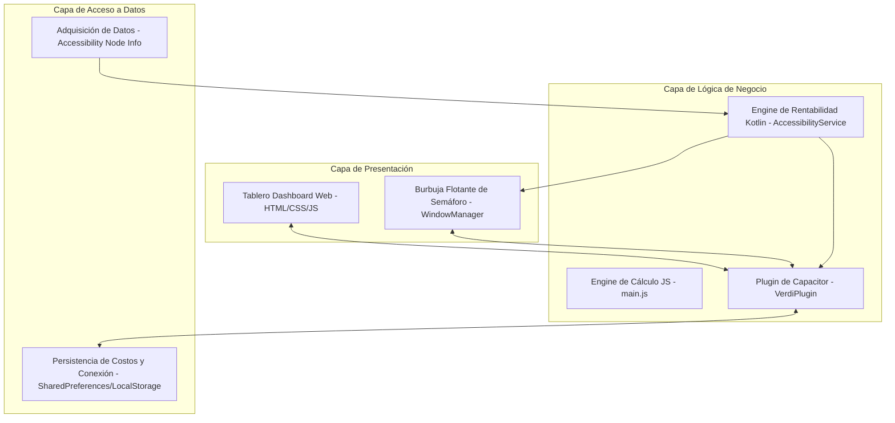
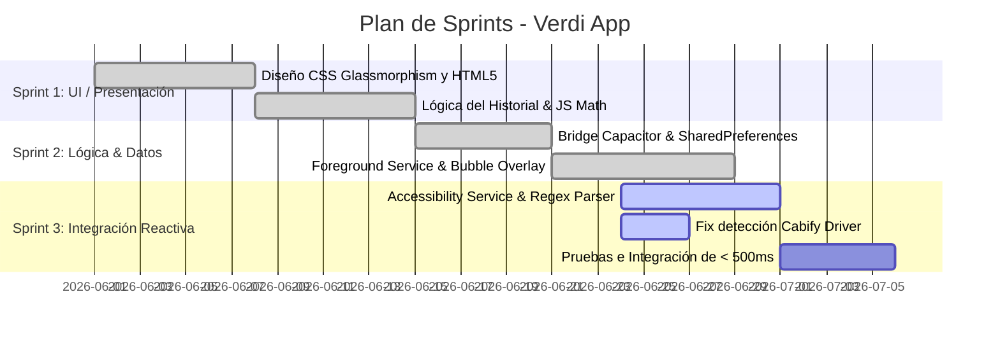

# Verdi - Copiloto Inteligente de Rentabilidad

Verdi es una aplicación móvil híbrida diseñada para conductores de aplicaciones de transporte (Uber, DiDi, Cabify). Su función principal es analizar en tiempo real las ofertas de viajes que aparecen en la pantalla y clasificar su rentabilidad mediante un sistema de semáforo de colores (Grafito, Verde, Amarillo, Rojo).

---

## 🏛️ Arquitectura de 3 Capas (3-Tier Architecture)

El software de Verdi está estructurado siguiendo el patrón de arquitectura de 3 capas para asegurar el desacoplamiento del código, facilitando el desarrollo y la escalabilidad del sistema:


```mermaid
graph TD
    subgraph Capa de Presentación
        UI[Tablero Dashboard Web - HTML/CSS/JS]
        Bubble[Burbuja Flotante de Semáforo - WindowManager]
    end
    
    subgraph Capa de Lógica de Negocio
        MathJS[Engine de Cálculo JS - main.js]
        MathKT[Engine de Rentabilidad Kotlin - AccessibilityService]
        Bridge[Plugin de Capacitor - VerdiPlugin]
    end
    
    subgraph Capa de Acceso a Datos
        Prefs[Persistencia de Costos y Conexión - SharedPreferences/LocalStorage]
        ScreenReader[Adquisición de Datos - Accessibility Node Info]
    end
    
    UI <--> Bridge
    Bubble <--> Bridge
    Bridge <--> Prefs
    ScreenReader --> MathKT
    MathKT --> Bubble
    MathKT --> Bridge
```

### 1. Capa de Presentación (Presentation Layer)
Gestiona la interfaz de usuario y captura las interacciones directas del conductor:
* **Tablero de Control Web (Vite + CSS + JS):** Una interfaz premium con tema oscuro, efecto glassmorphism y micro-animaciones que permite al conductor modificar sus costos, verificar estadísticas de su turno y revisar el historial del turno.
* **Burbuja Flotante e Interfaz Superpuesta (Kotlin - WindowManager):** Componente visual nativo (Overlay UI) que se dibuja sobre aplicaciones externas, cambia su color en menos de 500 ms y se expande al ser tocado para detallar la rentabilidad estimada.

### 2. Capa de Lógica de Negocio (Business Logic Layer)
Se encarga de procesar la información y aplicar el algoritmo de rentabilidad operacional del viaje:
* **Algoritmo de Rentabilidad:** Calcula la proyección de ingresos netos y la tasa de ganancia por distancia restando el costo proyectado de combustible. La tasa horaria se calcula y muestra a modo puramente informativo, mientras que el semáforo decide el color exclusivamente en función de la ganancia por distancia.
* **Capacitor Bridge (VerdiPlugin):** Actúa como el puente lógico entre el cliente web y el backend en Kotlin, coordinando las solicitudes de permisos nativos, la obtención del estado del último conductor conectado y el arranque del Foreground Service de la burbuja.

### 3. Capa de Datos (Data Layer)
Gestiona la persistencia de los parámetros y la captura de información cruda en pantalla:
* **Persistencia Local (SharedPreferences / LocalStorage):** Lee y escribe los valores de configuración de costos (precio de combustible, rendimiento del vehículo, ganancia por distancia, divisa), el estado de conexión persistente del último app de conductor activo, y almacena las coordenadas de la última posición preferida de la burbuja.
* **Adquisición Reactiva de Datos (Accessibility Node Scanner):** Servicio que interviene de manera segura en el árbol de elementos visuales de Uber/DiDi/Cabify para extraer los textos de tarifas, distancias y tiempos de viaje.

---

## 📋 Requerimientos Funcionales del Sistema

Basados en el documento de especificación funcional original de Verdi, el sistema cumple e implementa las siguientes capacidades y requerimientos funcionales:

1. **Detección y Captura Automática de Ofertas:** Monitoreo activo y seguro en segundo plano de las aplicaciones de transporte compatibles (Uber, DiDi y Cabify) para capturar ofertas de viajes en el momento en que aparecen en pantalla.
2. **Lectura Inteligente de Parámetros (OCR Local):** Extracción local (sin conexión a internet) del precio bruto, distancia total de viaje y tiempo estimado a partir de los elementos visuales de la pantalla.
3. **Configuración Operativa del Conductor:** Interfaz de configuración para ingresar costos reales: precio de combustible local, rendimiento del vehículo y ganancia mínima deseada por distancia.
4. **Cálculo de Rentabilidad y Semáforo:** Deducción automática del gasto proyectado de combustible de la tarifa capturada para calcular la ganancia neta y clasificar visualmente el viaje (Verde: Rentable, Amarillo: Aceptable, Rojo: No Recomendado/Pérdida) basándose en las metas configuradas.
5. **Burbuja Flotante Activa (Overlay UI):** Widget circular flotante que permanece visible sobre las apps de conductor, cambia de color reactivamente en menos de 500 ms, y es arrastrable por la pantalla (guardando su última ubicación).
6. **Detalle de Margen Operativo:** Panel desplegable al presionar la burbuja flotante que detalla el costo estimado de gasolina, ganancia neta proyectada y la tasa horaria estimada del viaje.
7. **Monitoreo de Estado y Conexión de Apps:** Detección en tiempo real de qué aplicación de conductor está activa y en primer plano, actualizando el tablero principal con el estado `"Conectado a [App]"` y el mensaje `"Esperando viaje..."`.
8. **Persistencia Local de Parámetros:** Guardado físico inmediato de todas las configuraciones del usuario (costos, monedas, unidades y posición de la burbuja) utilizando `SharedPreferences` y `LocalStorage` para que funcionen sin conexión.
9. **Soporte Multidivisa y Multiunidad:** Conversión automática de distancias (KM o Millas), unidades de combustible (Litros o Galones), rendimientos (KM/L o MPG) y monedas de la región (CLP, USD, COP, MXN, EUR, etc.).

---

## 👥 Marco de Trabajo Ágil: SCRUM

El ciclo de vida de desarrollo de Verdi se organiza bajo la metodología ágil **SCRUM**, orientando el desarrollo al valor continuo para el conductor (Product Owner).

### 1. Roles de Scrum
* **Product Owner (El Conductor):** Define las prioridades del Product Backlog basándose en las necesidades del día a día en la calle (ej. exactitud de los regex de distancias, rapidez de respuesta del semáforo).
* **Scrum Master:** Facilita la resolución de impedimentos técnicos (ej. control de permisos en Android 14 API 34, flujos de Foreground Services en segundo plano, compatibilidades de JVM).
* **Equipo de Desarrollo (Developers):** Equipo multidisciplinario encargado del desarrollo de la interfaz de usuario en JS/CSS y del backend nativo de Android en Kotlin.

### 2. Artefactos de Scrum
* **Product Backlog:** Listado de historias de usuario derivadas del documento funcional `Verdi.docx` (burbuja flotante, lectura inteligente, guardado local de configuraciones, historial local, monitoreo de conexión).
* **Sprint Backlog:** Tareas seleccionadas del Backlog para ser completadas en el Sprint activo.
* **Incremento de Software:** Entregable ejecutable (archivo APK compilado y depurado) con el semáforo inteligente y la lectura de pantalla operativa.

### 3. Planificación de Sprints


```mermaid
gantt
    title Plan de Sprints - Verdi App
    dateFormat  YYYY-MM-DD
    section Sprint 1: UI / Presentación
    Diseño CSS Glassmorphism y HTML5    :done, s1, 2026-06-01, 7d
    Lógica del Historial & JS Math      :done, s2, after s1, 7d
    section Sprint 2: Lógica & Datos
    Bridge Capacitor & SharedPreferences :done, s3, 2026-06-15, 6d
    Foreground Service & Bubble Overlay  :done, s4, after s3, 8d
    section Sprint 3: Integración Reactiva
    Accessibility Service & Regex Parser :active, s5, 2026-06-24, 7d
    Fix detección Cabify Driver          :active, s6, 2026-06-24, 3d
    Pruebas e Integración de < 500ms     :s7, after s5, 5d
```

* **Sprint 1: Capa de Presentación & Historial (Duración: 2 Semanas)**
  * **Sprint Goal:** Crear la interfaz del conductor y validar los cálculos de rentabilidad de forma visual.
  * **Entregable:** Dashboard web interactivo con controles deslizantes y pestaña de historial de viajes.
* **Sprint 2: Lógica de Interfaz y Datos Locales (Duración: 2 Semanas)**
  * **Sprint Goal:** Establecer la persistencia de datos nativa y la interfaz flotante sobre otras apps.
  * **Entregable:** Aplicación empaquetada que inicia el Foreground Service y persiste los parámetros en SharedPreferences.
* **Sprint 3: Captura de Datos Reactiva en Tiempo Real (Duración: 2 Semanas) — ✅ Completado**
  * **Sprint Goal:** Ligar la lectura automática de pantalla con los cálculos nativos en tiempo real y mostrar el estado de conexión a las apps.
  * **Entregable:** APK de Verdi con el servicio de accesibilidad leyendo ofertas en Uber/DiDi/Cabify, actualizando el semáforo e indicando a qué app se encuentra conectado.
* **Sprint 4: Estabilización del Sistema de Detección (Duración: 1 Semana) — ✅ Completado**
  * **Sprint Goal:** Resolver los bugs de detección de app activa, registro correcto del plugin Capacitor y estabilidad del estado entre transiciones de apps.
  * **Entregable:** APK estable con detección confiable de Cabify/Uber/DiDi, transición correcta entre primer y segundo plano, y badges de instalación actualizados en tiempo real.

---

## 🛠️ Registro de Cambios (Changelog)

### v1.1.0 — Sprint 4 (2026-07-04)

#### 🐛 Bugs Corregidos

| # | Componente | Descripción del bug | Solución aplicada |
|---|---|---|---|
| 1 | `MainActivity.kt` | `VerdiPlugin` no estaba registrado en Capacitor. El error `"Verdi" plugin is not implemented on android` causaba que `VerdiPlugin.load()` nunca se llamara, `instance` siempre fuera `null` y ningún evento llegara al JS. | Se agregó `registerPlugin(VerdiPlugin::class.java)` en `onCreate()` antes de `super.onCreate()`. |
| 2 | `VerdiAccessibilityService.kt` | `detectForegroundAppFromWindowsList()` usaba `?: continue` para la ventana topmost desconocida (ej. Verdi), continuando el loop y encontrando el launcher en background, disparando falsos resets a "Ninguna". | Cambiado a `?: return` — si la ventana topmost es desconocida, se detiene el procesamiento sin modificar el estado. |
| 3 | `main.js` | Los badges `install-badge-uber/didi/cabify` mostraban "Detectando..." permanentemente porque nunca se actualizaba el DOM desde `checkAndroidPermissions`. | Se añade la actualización del badge ("Instalado" / "No instalado") tras recibir `res.uberInstalled`, `res.didiInstalled`, `res.cabifyInstalled`. |
| 4 | `main.js` | Si el evento `onAppConnected` se perdía (timing: Verdi en background cuando Cabify disparó el evento), la UI quedaba en "Inactivo" indefinidamente. | `checkAndroidPermissions` ahora llama a `updateAppConnectionUI(res.activeApp)` cuando la UI no está bloqueada, actualizando el panel cada 2 segundos desde la fuente nativa. |
| 5 | `VerdiPlugin.kt` | Los eventos `notifyListeners` se perdían cuando la app estaba en background al momento de dispararse. | Se agregó `retainUntilConsumed = true` en `notifyListeners` para `onAppConnected` y `onTripCaptured`, garantizando entrega cuando el listener JS se registra. |
| 6 | `VerdiPlugin.kt` | Si Cabify se abría antes que Verdi, `instance` era `null` al momento del evento y se perdía. | `load()` ahora "reproduce" el estado actual: lee `VerdiAccessibilityService.activeApp` y lo emite inmediatamente al WebView con `retainUntilConsumed = true`. |
| 7 | `VerdiPlugin.kt` | Al cerrar Cabify, el campo `checkPermissions` caía al fallback de `UsageStatsManager` (ventana de 5 min) y seguía mostrando Cabify como activo. | Cuando `activeApp == "Ninguna"` (reset explícito del servicio de accesibilidad), se omiten los fallbacks de UsageStats y SharedPreferences en `checkPermissions`. |
| 8 | `VerdiAccessibilityService.kt` | Al cambiar de Cabify a Verdi, el launcher aparecía brevemente en la lista de ventanas, disparando `commitActiveApp("Ninguna")` y reseteando el estado antes de que Verdi cargara. | Se implementó un **debounce de 4 segundos** para el reset a "Ninguna": transiciones rápidas (<4s) no afectan el estado; cierres genuinos de la app resetean correctamente tras 4s. |

#### ✨ Mejoras

- **Registro explícito del plugin:** `MainActivity` ahora registra `VerdiPlugin` antes de inicializar el bridge, garantizando compatibilidad en todos los dispositivos Android.
- **Debounce de estado "Ninguna":** Elimina falsos resets durante transiciones entre apps. El conductor puede cambiar entre Cabify y Verdi sin perder el estado de conexión.
- **Replay de estado en carga:** Al abrir Verdi tras haber activado Cabify, el plugin sincroniza el estado inmediatamente en lugar de esperar el próximo ciclo de polling.
- **Badges de instalación en tiempo real:** Uber, DiDi y Cabify muestran correctamente "Instalado" o "No instalado" actualizados cada 2 segundos.

### v1.4.0 — Sprint 6 (2026-08-01)

#### 🐛 Bugs Corregidos

| # | Componente | Descripción del bug | Solución aplicada |
|---|---|---|---|
| 1 | `FloatingBubbleService.kt`, `VerdiAccessibilityService.kt`, `VerdiPlugin.kt` | La burbuja flotante no cambiaba de color (permanecía grafito 🔘) aunque el análisis de rentabilidad era correcto. En Android 13+, los broadcasts locales `UPDATE_BUBBLE` enviados con `setPackage(...)` no se entregaban al servicio de forma confiable cuando la app estaba en background o el sistema recortaba procesos. | Se eliminó por completo el mecanismo de broadcast. Se adoptó el patrón de **llamada directa** mediante `companion object`: `FloatingBubbleService` expone `updateBubble(...)` a través de una referencia `@Volatile private var instance`. Los llamadores (`VerdiAccessibilityService` y `VerdiPlugin`) invocan `FloatingBubbleService.updateBubble(...)` directamente, garantizando entrega instantánea sin intermediarios de IPC. |
| 2 | `FloatingBubbleService.kt` | Posible **race condition** visual: si dos análisis consecutivos llegaban rápido, el `stateColor` capturado dentro del `Handler.post` podía corresponder al segundo análisis mientras el fondo reflejaba el primero, resultando en emoji y color inconsistentes. | `stateColor` ahora se captura en una variable local **antes** del `Handler.post`, congelando el valor correcto en el closure del hilo principal. |
| 3 | `FloatingBubbleService.kt` | Si el servicio recibía una actualización mientras las vistas aún se estaban inicializando, se producía un `NullPointerException`. | `instance = this` se asigna al final de `onCreate()`, **después** de que `createBubbleView()` y `createPanelView()` completan, eliminando la ventana de inicialización parcial. |

#### ✨ Mejoras Técnicas
- **Eliminación del BroadcastReceiver:** `FloatingBubbleService` ya no registra ni necesita un `BroadcastReceiver` para `UPDATE_BUBBLE`. Esto reduce el overhead de IPC, elimina dependencias de contexto Android y simplifica el ciclo de vida del servicio.
- **Limpieza de `instance` en `onDestroy`:** Al destruirse el servicio, `instance` se pone a `null` antes de cualquier otra operación, evitando llamadas a vistas ya removidas del `WindowManager`.

### v1.7.0 — Sprint 8 (2026-08-08)

#### 🐛 Bugs Corregidos

| # | Componente | Descripción del bug | Solución aplicada |
|---|---|---|---|
| 1 | `VerdiPlugin.kt` | La configuración guardada por el conductor (ganancia mínima, precio de combustible, etc.) no se aplicaba al motor de cálculo nativo. `editor.apply()` escribe `SharedPreferences` de forma **asíncrona**, y el broadcast `CONFIG_UPDATED` se enviaba antes de que los datos terminaran de escribirse. Al recibir el broadcast, `VerdiAccessibilityService.loadConfig()` leía los valores **anteriores**, ignorando los cambios del conductor. | Reemplazado `editor.apply()` por `editor.commit()` (síncrono). Garantiza que los datos estén completamente persistidos antes de notificar al servicio. |
| 2 | `main.js` | Tras unos minutos de uso, la app se "pegaba" y dejaba de reaccionar. `checkAndroidPermissions` se llama cada 2 segundos via `setInterval`. Si el plugin nativo tardaba más de 2 segundos en responder, se apilaban múltiples llamadas concurrentes, degradando y congelando el WebView. | Añadido el flag `_checkingPermissions`: si ya hay una llamada en curso, la siguiente se descarta hasta que termine la anterior. |
| 3 | `main.js` | El resultado del viaje (semáforo verde/amarillo/rojo y datos del análisis) desaparecía de pantalla a los **6 segundos**, volviendo al estado grafito antes de que el conductor pudiera leer el análisis. | El umbral `timeSinceCapture` aumentado de `6 000 ms` a `30 000 ms` en los 3 puntos de la UI donde se aplica, manteniendo el resultado visible durante 30 segundos. |

#### ✨ Mejoras
- **Configuración inmediata:** Los cambios de parámetros en la pestaña de Ajustes ahora se propagan al motor de decisión en tiempo real, sin necesidad de reiniciar el servicio.
- **App más estable en sesiones largas:** La eliminación de llamadas concurrentes al plugin nativo mejora la fluidez del dashboard durante turnos prolongados.
- **Más tiempo para analizar:** El conductor tiene 30 segundos para leer el análisis de cada viaje antes de que el panel vuelva al estado de espera.

---

### v1.6.0 — 2026-08-06

#### 🐛 Bugs Corregidos

| # | Componente | Descripción del bug | Solución aplicada |
|---|---|---|---|
| 1 | `VerdiAccessibilityService.kt` | El `pricePattern` solo reconocía `$`, `€` y `¥` como prefijos de moneda. Uber Chile envía los precios con el formato `CLP7,604`, por lo que nunca se producía match, `detectedPrice` quedaba `null`, no se disparaba `onTripCaptured` y tanto la burbuja como el semáforo del Dashboard permanecían en blanco/grafito indefinidamente. | Se amplió `pricePattern` para reconocer los códigos ISO de moneda latinoamericanos (`CLP`, `COP`, `ARS`, `MXN`, `PEN`, `BRL`, `UYU`) y globales (`USD`, `EUR`) además de los símbolos originales. El grupo capturador se hizo greedy (`[0-9][0-9.,]*`) para cubrir valores con separadores de miles como `"7,604"` o `"1,234,567"`. |
| 2 | `VerdiAccessibilityService.kt` | Con el regex más greedy, el grupo capturado podía incluir un separador residual al final (ej. `"7,604."`) y fallar silenciosamente en `parseFlexibleNumber` devolviendo `null`. | Se añadió `.trimEnd(',', '.')` al inicio de `parseFlexibleNumber` para recortar separadores sobrantes antes de aplicar cualquier lógica de conversión. |

#### ✨ Mejoras
- **Soporte completo de monedas regionales en la detección:** el parser de pantalla ahora identifica precios expresados con prefijos de texto (`CLP`, `COP`, `ARS`, etc.) o con símbolos (`$`, `€`, `£`), tanto antes como después del valor numérico.
- **Parser de números más robusto:** `parseFlexibleNumber` tolera entradas con separadores residuales al final sin arrojar errores ni devolver `null` inesperadamente, manteniendo la cadena de análisis siempre operativa.

---

### v1.5.0 — 2026-08-06

#### 🐛 Bugs Corregidos

| # | Componente | Descripción del bug | Solución aplicada |
|---|---|---|---|
| 1 | `FloatingBubbleService.kt`, `VerdiAccessibilityService.kt`, `VerdiPlugin.kt` | El overlay podía quedarse sin actualizar el estado del viaje si el servicio arrancaba después de la primera captura, dejando la burbuja en grafito y sin reflejar la información del panel. | Se implementó un buffer de estado pendiente en `FloatingBubbleService` y se aplica al crear el overlay, de modo que el primer viaje se conserva aunque el servicio se inicie más tarde. |
| 2 | `VerdiPlugin.kt` | Al reabrir la app tras dejarla cerrada mucho tiempo, podía aparecer `DiDi` como última app activa aunque esa app no estuviera instalada. | Se validó el estado contra la instalación real de Uber/DiDi/Cabify antes de mostrarlo en UI y se limpió el valor persistido en `SharedPreferences` cuando ya no corresponde a una app instalada. |
| 3 | `VerdiPlugin.kt` | El arranque del servicio de burbuja era inestable en algunos dispositivos Android al iniciarlo con `startService`. | Se reemplazó por `ContextCompat.startForegroundService(...)` para garantizar un arranque más robusto del overlay en segundo plano. |

#### ✨ Mejoras
- **Estado de overlay robusto:** el panel y la burbuja conservan el último estado del viaje aunque la app haya sido cerrada y reabierta.
- **Limpieza de estados obsoletos:** la app ya no muestra apps de conductor que no están instaladas, evitando falsos activos en el dashboard.
- **Mayor estabilidad en Android 13+:** el arranque del overlay ahora sigue el flujo recomendado para servicios en primer plano.

---

### v1.3.0 — Sprint 5 (2026-07-26)

#### 🐛 Bugs Corregidos

| # | Componente | Descripción del bug | Solución aplicada |
|---|---|---|---|
| 1 | `FloatingBubbleService.kt` | La burbuja de servicio no actualizaba su color en pantalla. La mutación del `GradientDrawable` de fondo no provocaba el redibujado de la vista. | Se implementó la mutación explícita del background drawable (`.mutate()`) y la invocación obligatoria a `windowManager.updateViewLayout(bubbleLayout, params)` en el hilo principal para forzar al `WindowManager` a redibujar el overlay con su nuevo estado. |
| 2 | `main.js` | El asistente de instrucciones de bienvenida e inducción (Wizard) se cerraba de forma inmediata al iniciar si existía la bandera de completado en localStorage, dejando al usuario con permisos desactivados. | Se modificó `shouldShow()` para que siempre mantenga visible el Wizard si falta otorgar accesibilidad o burbuja flotante. |
| 3 | `VerdiPlugin.kt` y `VerdiAccessibilityService.kt` | Los broadcasts `UPDATE_BUBBLE` no se entregaban de forma de confianza en dispositivos con Android 13+ debido a restricciones de seguridad sobre intents implícitos. | Se configuró `intent.setPackage(...)` para que el intent sea explícito y el sistema Android lo enrute correctamente. |

#### ✨ Mejoras y Soporte
- **Pestaña interactiva de Ayuda:** Se incorporó una nueva sección de Ayuda (`tab-help`) con instrucciones gráficas paso a paso y acordiones personalizados por marca de teléfono (Xiaomi, Samsung, Realme, Motorola).
- **Atajo para Ajustes Restringidos:** Añadido un botón de diagnóstico rápido en el asistente de ayuda que abre la Info de la App de Verdi, permitiendo al usuario autorizar "Ajustes Restringidos" con dos toques y desbloquear el interruptor gris de accesibilidad.

### v1.2.0 — Sprint 5 (2026-07-24)

#### ✨ Mejoras y Simplificación de Permisos

- **Simplificación del Sistema de Permisos:** Se eliminaron por completo las solicitudes de permisos de Ubicación (`ACCESS_FINE_LOCATION`, etc.) y Bluetooth en la app, reduciendo el acoso de cuadros de diálogo y aumentando la confianza del usuario.
- **Remoción de UsageStats:** Se eliminó el requisito del permiso oculto de Estadísticas de Uso (`PACKAGE_USAGE_STATS`). La detección nativa de apps activas ahora recae de forma exclusiva y limpia en el `VerdiAccessibilityService`.
- **Asistente (Wizard) de Permisos Dinámico:**
  - Analiza y salta pasos de manera adaptativa si detecta que el permiso de accesibilidad o burbuja ya están habilitados.
  - Reacción instantánea mediante `visibilitychange` al regresar de la configuración del sistema Android.
  - Botones interactivos que cambian a verde con la etiqueta `"✓ ¡Permiso Otorgado!"` antes de avanzar automáticamente tras 1 segundo.
  - Resumen dinámico del paso final personalizado que advierte sobre las consecuencias de omitir pasos específicos.
- **Mejoras en el Comportamiento de la Burbuja (Overlay):**
  - **Efecto de Atracción (Snap):** Al ser arrastrada por la pantalla y liberada, la burbuja siempre hace snap horizontal de forma automática y magnética hacia el costado derecho del dispositivo (`x=0`).
  - **Apagado Sencillo y Directo:** Se integró un botón rojo `"APAGAR SEMÁFORO"` en el panel detallado que apaga el servicio directamente (`stopSelf()`).
  - **Sincronización Web-Nativa:** El Dashboard de control web detecta la terminación del proceso nativo de la burbuja y actualiza instantáneamente el interruptor a "Iniciar".

---

## 🚀 Funcionalidades Clave

* **🔍 Captura Automática y Lectura Inteligente:** Monitorea y lee en tiempo real el contenido de la pantalla cuando el conductor está en Uber, DiDi o Cabify, extrayendo la tarifa, distancia y tiempo del viaje.
* **🧮 Algoritmo de Rentabilidad Offline:** Realiza el cálculo matemático de rentabilidad deduciendo el costo estimado de combustible y verificando si cumple con tus objetivos de ingresos por distancia. Funciona de manera 100% local (sin depender de conexión a internet).
* **🟢 Semáforo Inteligente:** Muestra de forma visual e inmediata la calidad del viaje:
  * **Verde (Rentable):** Cumple con la meta de ganancia por distancia.
  * **Amarillo (Marginal):** Viaje aceptable que se encuentra cerca del límite mínimo de distancia.
  * **Rojo (Poco rentable / Pérdida):** No cumple la meta mínima de distancia o genera pérdida.
* **📡 Monitoreo e Instalación de Apps de Conductor (Novedad):** Verifica si las aplicaciones oficiales de conductor (**Uber Driver**, **DiDi Conductor** y **Cabify Driver**) están instaladas en el dispositivo, informando su estado en tiempo real (**Instalada / En segundo plano**, **Activa / En primer plano** o **No detectada**).
* **💬 Burbuja Flotante de Servicio (Control Directo):** Un widget interactivo que flota sobre las otras aplicaciones y cambia de color en menos de 500 ms al recibir un viaje. Se puede iniciar y detener directamente desde el panel principal con un botón interactivo y es libremente arrastrable.
* **🌎 Soporte Regional Adaptable:** Admite múltiples monedas (CLP, USD, COP, MXN, EUR, etc.) y unidades regionales (KM/Millas, Litros/Galones, KM/L, MPG) sin alterar la lógica interna.

---

## 💻 Tecnologías Utilizadas

* **HTML5 & CSS3 Premium:** Tema oscuro con glassmorphism.
* **JavaScript Moderno (ES6):** Reactividad en la UI del panel de control.
* **Vite:** Motor de desarrollo y empaquetado para una carga ultrarrápida.
* **Capacitor 6:** Framework de empaquetado e integración del plugin de puente nativo.
* **Kotlin (1.9.25):** Lógica nativa de segundo plano y servicios Android.
* **Android Accessibility Services:** Captura en tiempo real de textos en pantalla.
* **Android WindowManager Overlay:** Renderizado de UI flotante en el sistema.

---

## 🚀 Cómo Ejecutar el Proyecto

### Requisitos Previos
* **Node.js** (v18 o superior) instalado.
* **Android Studio** instalado con el SDK de Android (API 34 recomendada).
* **JDK** — Se recomienda [Eclipse Adoptium Temurin 17+](https://adoptium.net/). Si `JAVA_HOME` apunta a una ruta inválida, corregir antes de compilar:
  ```powershell
  $env:JAVA_HOME = "C:\Program Files\Eclipse Adoptium\jdk-25.0.3.9-hotspot"
  ```
* Un teléfono físico Android con depuración USB activa (para probar la burbuja y accesibilidad) o un emulador.

### Paso 1: Instalar dependencias e iniciar el servidor de desarrollo
1. Instala los paquetes:
   ```bash
   npm install
   ```
2. Ejecuta el servidor web local:
   ```bash
   npm run dev
   ```

### Paso 2: Compilar y sincronizar con Android
> ⚠️ **Orden importante:** Siempre ejecutar `npm run build` **antes** de `npx cap sync android`. El sync copia el contenido de `dist/` al proyecto Android; si se hace al revés se empaqueta el bundle anterior.

1. Construye el bundle de producción web:
   ```bash
   npm run build
   ```
2. Sincroniza con Android:
   ```bash
   npx cap sync android
   ```

### Paso 3: Compilar y Lanzar la App
1. Para compilar desde consola en Windows (corregir `JAVA_HOME` si es necesario):
   ```powershell
   $env:JAVA_HOME = "C:\Program Files\Eclipse Adoptium\jdk-25.0.3.9-hotspot"
   cd android
   .\gradlew assembleDebug
   ```
   El APK resultante queda en `android/app/build/outputs/apk/debug/app-debug.apk`.
2. O abre el proyecto en Android Studio y haz clic en **Run app**:
   ```bash
   npx cap open android
   ```
   Conecta tu dispositivo Android y haz clic en **Run app** (botón verde de reproducción) en Android Studio para instalarla.

### Paso 4: Activación de los permisos en el teléfono
1. Abre la app **Verdi** instalada.
2. En la pestaña **Panel**, otorga el permiso de **Burbuja Flotante** (Permitir mostrar sobre otras aplicaciones).
3. Otorga el permiso de **Lectura de Pantalla** (se abrirán los Ajustes de Accesibilidad de tu teléfono. Busca "Verdi", **desactívalo y vuélvelo a activar** para asegurar que el sistema Android lo inicialice correctamente).
4. Pulsa **Iniciar** en la tarjeta *Burbuja de Servicio* del Panel.
5. Abre Uber, DiDi o Cabify. El Dashboard de Verdi mostrará la app como **Activo** y la burbuja pasará a color Grafito (`🔘`) esperando ofertas. Al recibir un viaje, se iluminará con el color del semáforo correspondiente y mostrará el análisis de rentabilidad.

### Depuración con Logcat
Para ver logs de Verdi en tiempo real (requiere USB Debugging activo):
```powershell
$adb = "$env:LOCALAPPDATA\Android\Sdk\platform-tools\adb.exe"
& $adb logcat | Select-String "Verdi"
```

---

## 🐛 Problemas Conocidos y Fixes Aplicados

| # | Problema | Fix | Estado |
|---|----------|-----|--------|
| 1 | El Dashboard mostraba Cabify como "Inactivo" al volver a Verdi desde Cabify Driver | `VerdiPlugin.kt`: `currentActiveApp` excluye `"Verdi (Pruebas)"`, retorna `lastConnectedApp` en su lugar | ✅ Resuelto |
| 2 | El listener `onAppConnected` limpiaba el estado de conexión al activarse Verdi en primer plano | `main.js`: ignorar eventos con `appName === 'Verdi (Pruebas)'` | ✅ Resuelto |
| 3 | `updateAppConnectionUI` fallaba silenciosamente por elementos cacheados null | `main.js`: reescrita con `document.getElementById` directo y null-safety completa | ✅ Resuelto |
| 4 | Build desactualizado si se ejecutaba `npx cap sync android` antes de `npm run build` | Documentado el orden correcto del proceso de build | ✅ Documentado |
| 5 | La burbuja de servicio no cambiaba de color al detectar rentabilidades (intento previo) | Se reasignó el fondo y se invalidó la vista en el UI thread de `FloatingBubbleService.kt` | ✅ Resuelto parcialmente en v1.3 |
| 6 | El Wizard de instrucciones se ocultaba inmediatamente en el inicio de la app | Se modificó `shouldShow()` para evaluar permisos activos en vez de flags de almacenamiento local | ✅ Resuelto |
| 7 | La burbuja no cambiaba de color en Android 13+ (causa raíz definitiva) | Reemplazo total del sistema de broadcasts `UPDATE_BUBBLE` por llamada directa `FloatingBubbleService.updateBubble(...)` via `companion object` | ✅ Resuelto en v1.4 |
| 8 | El overlay se quedaba sin estado cuando el servicio arrancaba después del primer viaje | Se agregó un buffer de estado pendiente que se reaplica al crear el overlay | ✅ Resuelto en v1.5 |
| 9 | El dashboard mostraba una app como activa aunque no estuviera instalada (por ejemplo DiDi) | Se valida la app real contra los paquetes instalados y se limpia el estado persistido si ya no corresponde | ✅ Resuelto en v1.5 |
| 10 | La burbuja y el Dashboard quedaban en blanco/grafito al recibir ofertas en Uber Chile — el precio venía como `CLP7,604` y el regex solo reconocía `$`/`€`/`¥`, por lo que `detectedPrice` siempre era `null` | Se amplió `pricePattern` en `VerdiAccessibilityService.kt` para incluir códigos ISO (`CLP`, `COP`, `ARS`, `MXN`, `PEN`, `BRL`, `UYU`, `USD`, `EUR`) y se reforzó `parseFlexibleNumber` con `.trimEnd(',', '.')` | ✅ Resuelto en v1.6 |
| 11 | La configuración de ganancia mínima no se aplicaba al motor de cálculo — `editor.apply()` era asíncrono y el broadcast `CONFIG_UPDATED` llegaba al servicio antes de que los nuevos valores estuvieran escritos, causando que siempre se usaran los valores anteriores y el semáforo siempre mostrara rojo | Reemplazado `editor.apply()` por `editor.commit()` en `VerdiPlugin.kt` | ✅ Resuelto en v1.7 |
| 12 | Después de varios minutos de uso la app se "pegaba" y dejaba de responder — `checkAndroidPermissions` (llamado cada 2s via `setInterval`) apilaba llamadas concurrentes cuando el plugin tardaba más de 2s, saturando el WebView | Añadido el flag `_checkingPermissions` en `main.js` para descartar llamadas solapadas | ✅ Resuelto en v1.7 |
| 13 | El resultado del viaje (semáforo de color) desaparecía a los 6 segundos, volviendo a grafito antes de que el conductor pudiera leer el análisis | Umbral `timeSinceCapture` aumentado de 6 000 ms a 30 000 ms en `main.js` | ✅ Resuelto en v1.7 |

